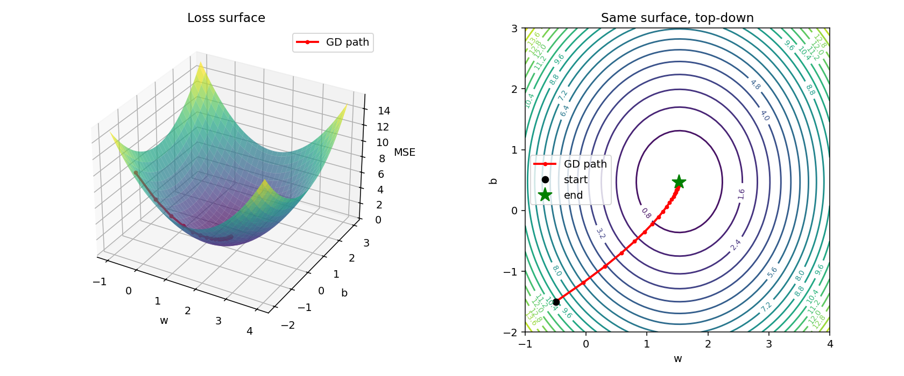
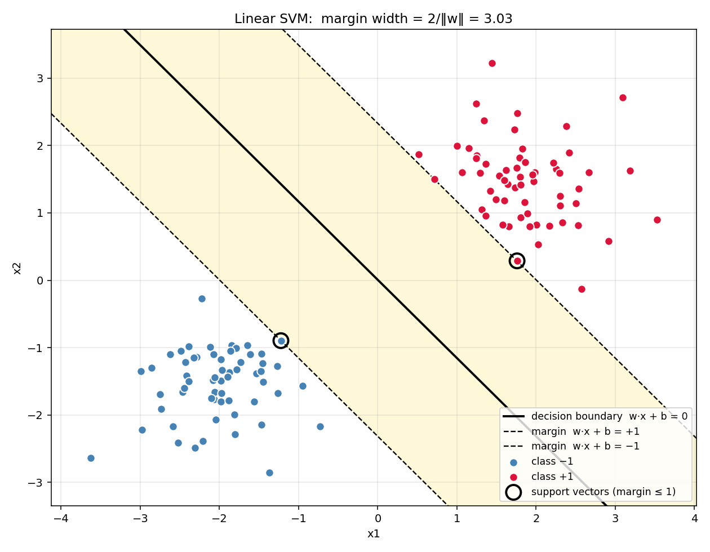
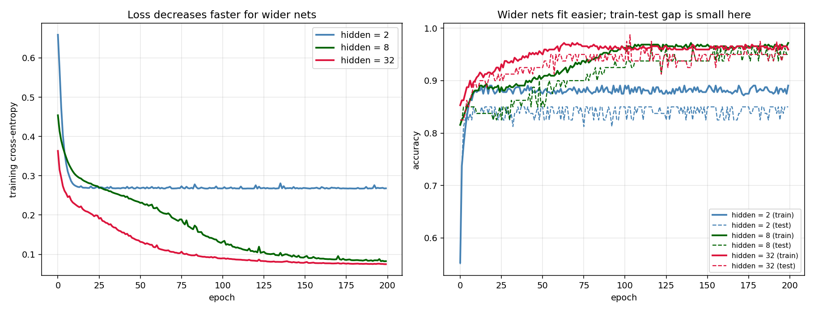
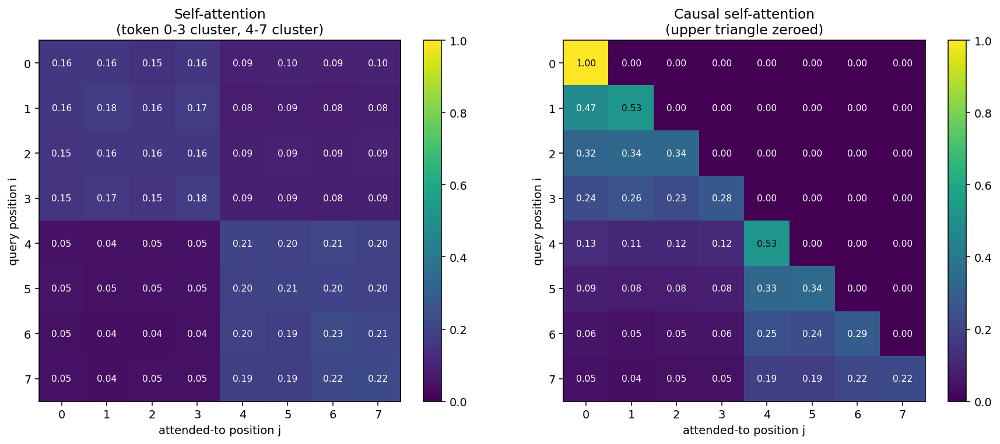

# Machine Learning, From Scratch

A theory-first course. You learn ML by **deriving the math**, **drawing the diagrams**, and **coding the algorithm from scratch in NumPy** — not by gluing together scikit-learn.

> Audience: comfortable Python, familiar with gradient descent and train/test, wants to *understand* every algorithm well enough to read papers and explain it on a whiteboard.

This is the theory counterpart to my [gen-ai](https://github.com/Lourdhu02/gen-ai) course.

---

## What you'll know by the end

- Derive closed-form and iterative solutions for the core supervised algorithms (OLS, logistic regression, SVM) from first principles.
- Read a paper's math section without skipping — you can follow the derivations.
- Explain any algorithm on a whiteboard: what it optimizes, why the geometry looks the way it does, and where it breaks.
- Build neural nets, CNNs, RNNs, attention, and Transformer blocks in NumPy — and know exactly what each line does.
- Diagnose training problems (vanishing gradients, overfitting, bad optimizers) from the shapes you've seen in the diagrams.

---

## Who this is for

- You know Python and have done a gradient descent assignment before.
- You want to *understand*, not just call `.fit()`.
- You're preparing for interviews, research, or a deeper dive into deep learning.

## Who this is not for

- Absolute beginners to Python or linear algebra — start with a general intro course first.
- People who want a cookiecutter tutorial or a scikit-learn cheat sheet.
- Anyone looking for a production deployment guide — this course stays in NumPy.

---

## How this course works

Every module follows the same seven-section layout:

1. **Intuition** — one paragraph, no jargon.
2. **Math** — derived step by step, not just stated.
3. **Diagram** — labeled matplotlib plot showing what the algorithm does geometrically.
4. **Mind-map** — Mermaid diagram placing this algorithm inside its family.
5. **From scratch** — a NumPy implementation (no scikit-learn for the core loop).
6. **When to use / when it breaks** — the honest version.
7. **References** — canonical links only.

No essays. Diagrams and equations carry the weight.

---

## How to use this course

1. Finish [`SETUP.md`](./SETUP.md).
2. Walk through [`course/00-math-foundations/README.md`](./course/00-math-foundations/) — the math primer.
3. For each module:
   - Read the **Intuition** and **Math** sections. Stop. Derive the key equation on paper yourself before looking at the solution.
   - Run the **From scratch** code. Tweak a parameter. See what breaks.
   - Study the **Diagram**. Make sure the plot matches the equation in your head.
   - Read **When to use / when it breaks**. Close the module.
4. Do the labs in order — they synthesize earlier modules.
5. Move on only when you can explain the module's core idea without looking.

Read. Derive. Plot. Code. Repeat.

---

## The Roadmap

| # | Module | Core idea | Math |
|---|---|---|---|
| 00 | [Math Foundations](./course/00-math-foundations/) | Just-enough linear algebra, calculus, probability | Full |
| 01 | [Linear Regression](./course/01-linear-regression/) | OLS closed-form and gradient descent, both derived | Full |
| 02 | [Logistic Regression](./course/02-logistic-regression/) | Sigmoid, log-likelihood, cross-entropy | Full |
| 03 | [Regularization](./course/03-regularization/) | Ridge, Lasso, ElasticNet — geometry of the penalty | Light |
| 04 | [SVM](./course/04-svm/) | Margin → primal → dual → kernel trick | Full |
| 05 | [Decision Trees](./course/05-decision-trees/) | Entropy, Gini, recursive splits | Mixed |
| 06 | [Ensembles](./course/06-ensembles/) | Bagging, Random Forest, AdaBoost, Gradient Boosting | Mixed |
| — | [Lab A: Classical Shootout](./course/lab-A-classical-shootout/) | Logistic vs SVM vs RF on one dataset | — |
| 07 | [Bayes & kNN](./course/07-bayes-and-knn/) | Naive Bayes derivation + kNN baseline | Light |
| 08 | [Clustering](./course/08-clustering/) | k-means + EM for GMM | Full |
| 09 | [Dim. Reduction](./course/09-dim-reduction/) | PCA via SVD, t-SNE / UMAP intuition | Mixed |
| — | [Lab B: PCA vs t-SNE vs UMAP](./course/lab-B-pca-tsne-umap/) | Three projections, side by side | — |
| 10 | [Neural Nets: MLP](./course/10-neural-nets-mlp/) | Forward pass + backprop derived by chain rule | Full |
| 11 | [Training Deep Nets](./course/11-training-deep-nets/) | SGD, momentum, Adam, dropout, batchnorm | Mixed |
| 12 | [CNNs](./course/12-cnns/) | Convolution as weight-sharing, receptive fields | Mixed |
| — | [Lab C: MLP vs CNN](./course/lab-C-mlp-vs-cnn/) | Same MNIST, same compute budget | — |
| 13 | [RNNs & LSTMs](./course/13-rnns-lstms/) | BPTT derived, vanishing gradients, LSTM gates | Full |
| 14 | [Attention](./course/14-attention/) | Scaled dot-product attention from scratch | Full |
| 15 | [Transformers](./course/15-transformers/) | Block, multi-head, positional encodings, LLM intuition | Full |
| — | [Lab D: Attention from Scratch](./course/lab-D-attention-from-scratch/) | NumPy attention vs PyTorch's | — |

---

## Selected diagrams

### Loss surface and gradient descent path

The MSE loss as a quadratic bowl; the gradient descent trajectory from a random start to the optimum. Module 01.

### SVM margin

The geometric margin, support vectors, and the optimal separating hyperplane. Module 04.

### MLP training and capacity

Training vs validation loss and accuracy for a small MLP on a non-linear problem. Module 10.

### Attention weights

The attention matrix over a sequence — which tokens attend to which. Module 14.

---

## Cite this course

If you use this material, cite it with `CITATION.cff` or:

> Lourdhu Raju. *Machine Learning, From Scratch: A theory-first course.* https://github.com/Lourdhu02/machine-learning-advanced, 2024. MIT License.

---

## License

MIT — see [LICENSE](LICENSE).
