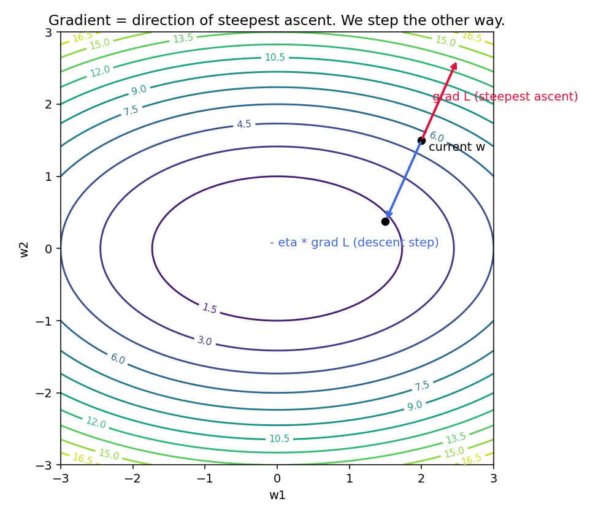
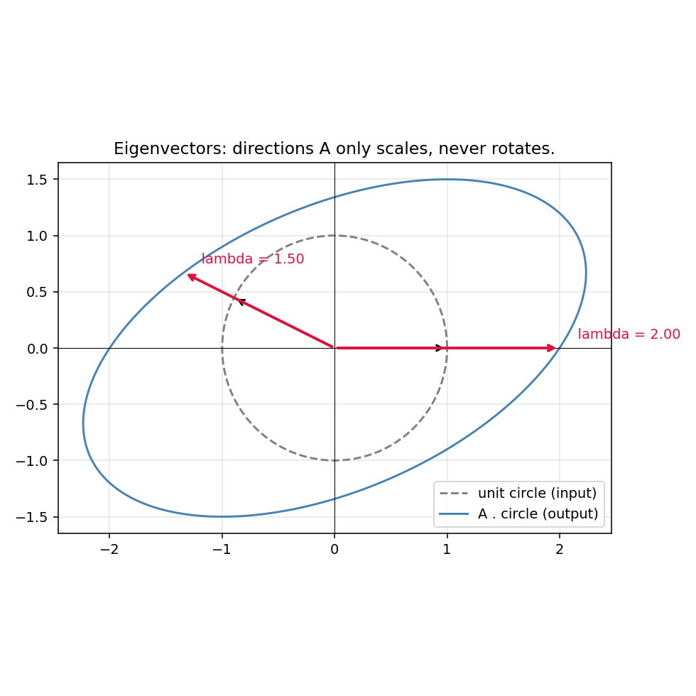
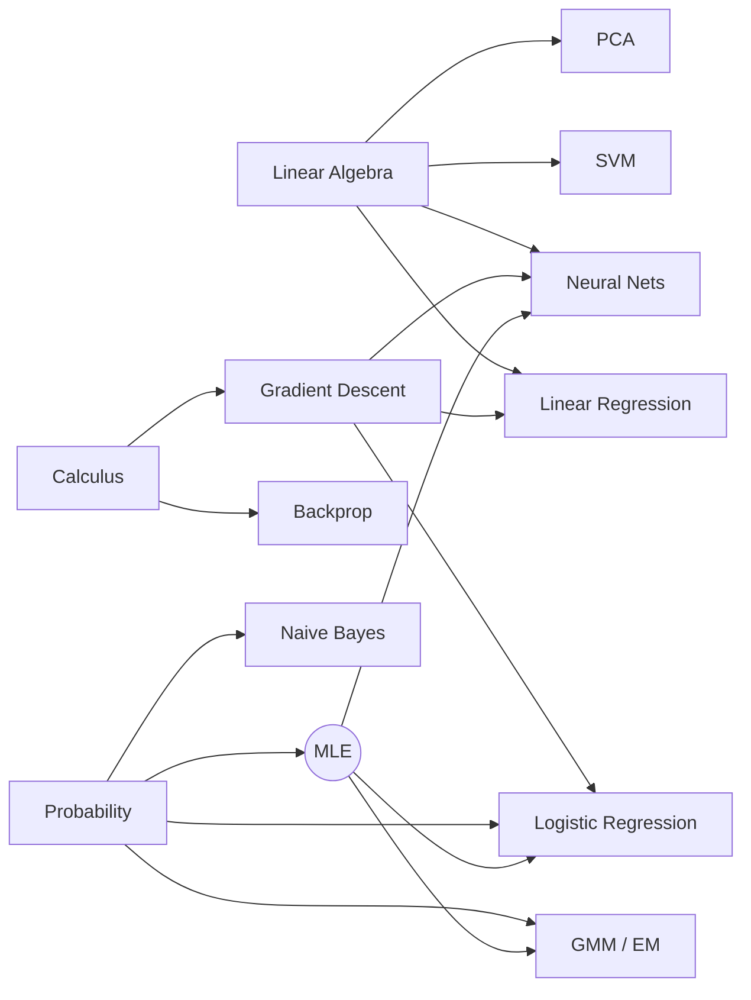

# 00 — Math Foundations

> Goal: gather the linear algebra, calculus, and probability you'll reuse in every later module — and the *derivation patterns* you'll see again and again.

---

## 1. Intuition

ML algorithms are recipes for turning data into a function. Three ingredients show up in every recipe: a **vector view** of the data (linear algebra), a **slope view** of the loss (calculus), and an **uncertainty view** of the world (probability). Get fluent in those three and the rest of the course is mostly rearranging.

---

## 2. The math you actually need

### 2.1 Linear algebra
- **Vector**: a list of numbers; geometrically, an arrow from the origin.
- **Dot product**: `a · b = Σ aᵢ bᵢ = ‖a‖ ‖b‖ cos θ`. Measures alignment. Zero ⇒ perpendicular.
- **Matrix–vector product** `Av`: stretches and rotates `v`. Columns of `A` are where the basis vectors land.
- **Eigenvector**: a direction that `A` doesn't rotate, only scales: `Av = λv`.
- **SVD**: any matrix `A = U Σ Vᵀ`. Decomposes any transformation into *rotate → scale → rotate*. Pillar of PCA (module 09).

### 2.2 Calculus
- **Derivative** `f'(x)`: slope at a point.
- **Gradient** `∇f(x)`: vector of partial derivatives. Points in the direction of *steepest ascent*. We descend it.
- **Chain rule**: `d/dx f(g(x)) = f'(g(x)) · g'(x)`. The single most important rule in ML — it *is* backprop (module 10).
- **Jacobian / Hessian**: gradient generalized to vector-valued outputs / second derivatives.

### 2.3 Probability
- **PMF / PDF**: probability of a discrete / continuous outcome.
- **Bayes' rule**: `P(A|B) = P(B|A) P(A) / P(B)`. Updates belief from evidence.
- **Likelihood** `L(θ) = P(data | θ)`: how plausible the data is under parameters `θ`.
- **Log-likelihood**: same thing, taken log. Sums instead of products → tractable to differentiate.
- **Maximum Likelihood Estimate (MLE)**: pick `θ` that maximizes `L(θ)`. Almost every algorithm in this course is secretly an MLE.

---

## 3. Diagrams

| Script | Shows |
|---|---|
| `diagram_gradient_geometry.py` | The gradient as the arrow of steepest ascent on a 2D loss surface, with one gradient-descent step |
| `diagram_eigenvectors.py` | A matrix's eigenvectors as the directions it doesn't rotate |

Regenerate:
```powershell
python diagram_gradient_geometry.py
python diagram_eigenvectors.py
```





---

## 4. Mind-map: how these tools feed the rest of the course



---

## 5. From-scratch sanity check

`from_scratch.py` does two things:
1. Verifies the chain rule numerically (finite-difference vs analytical gradient on `f(x) = sin(x²)`).
2. Verifies an eigendecomposition: reconstructs `A` from `Q Λ Q⁻¹` and prints the max error.

Run it. If both checks print `OK`, your environment is healthy and you have the two tools — chain rule and eigendecomp — that everything later will reuse.

---

## 6. When this primer is enough / when it isn't

**Enough for:** every module in this course.

**Not enough for:** measure-theoretic probability, manifold geometry, convergence proofs. None of which you need to read most ML papers.

---

## 7. References

- 3Blue1Brown — *Essence of Linear Algebra* (YouTube playlist). Best visual intro to vectors, matrices, eigenvectors.
- 3Blue1Brown — *Essence of Calculus*.
- Strang — *Linear Algebra and Its Applications* (book). Reference, not bedtime reading.
- Deisenroth, Faisal, Ong — *Mathematics for Machine Learning*. Free PDF: https://mml-book.github.io/
