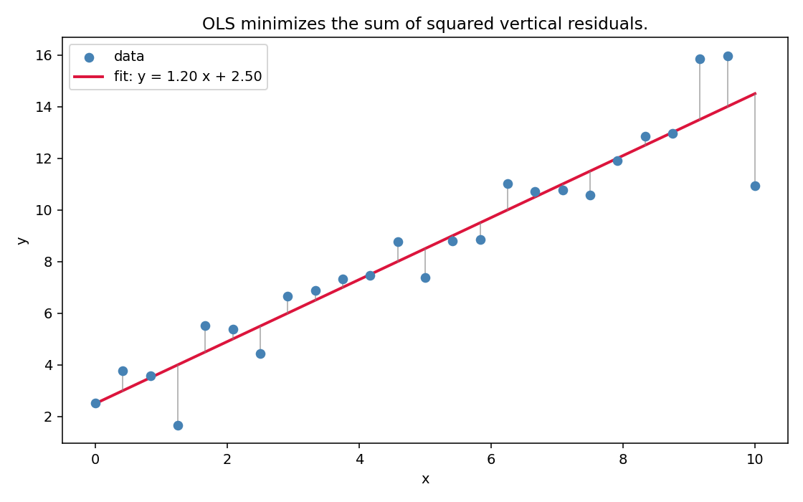
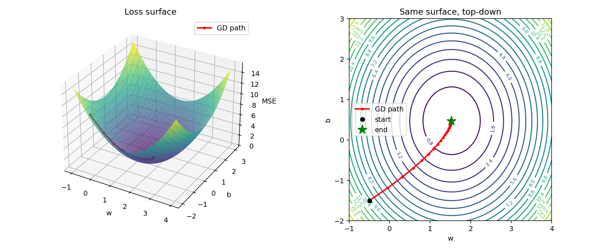
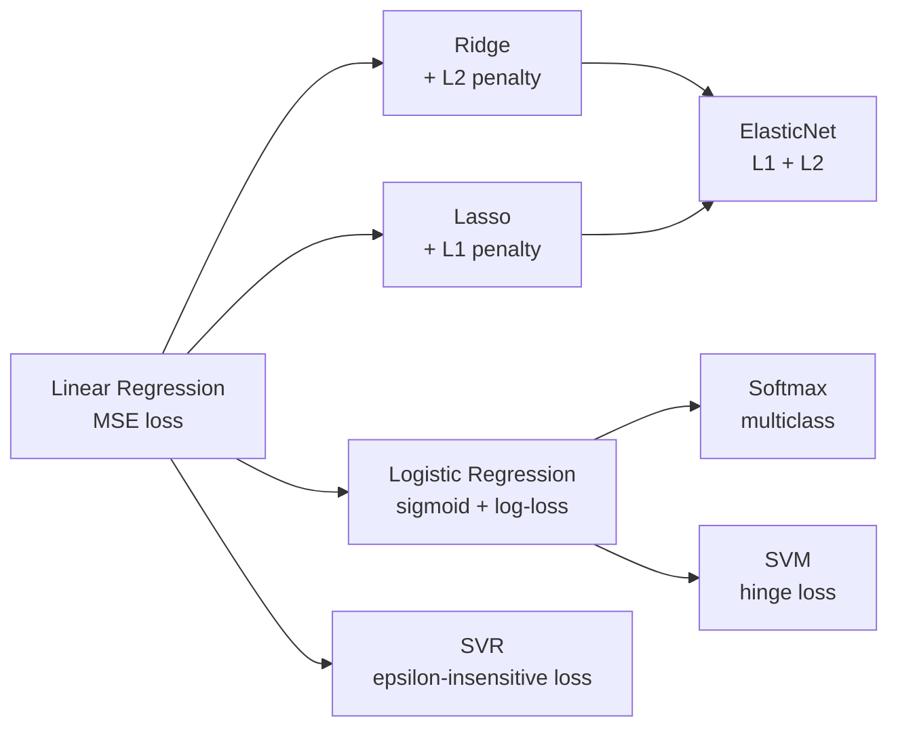

# 01 — Linear Regression

> Goal: derive the OLS solution two ways (closed-form, gradient descent), implement both from scratch, and see when each wins.

---

## 1. Intuition

Given a cloud of points `(x, y)`, find the line `y = wx + b` that minimizes the total *vertical* squared distance from the line to the points. That's it. Every more complicated regression is a variation on this single move.

---

## 2. The math, derived

Stack `n` samples into `X ∈ ℝⁿˣᵈ` (with a 1-column appended for the intercept), targets into `y ∈ ℝⁿ`, parameters into `w ∈ ℝᵈ⁺¹`.

**Model**

```
y_hat = X w
```

**Loss** — mean squared error:

```
L(w) = (1/n) ‖X w - y‖²
     = (1/n) (X w - y)ᵀ (X w - y)
```

### 2a. Closed form (set the gradient to zero)

Expand:

```
L(w) = (1/n) ( wᵀ Xᵀ X w  -  2 yᵀ X w  +  yᵀ y )
```

Differentiate w.r.t. `w`:

```
∇_w L = (2/n) ( Xᵀ X w  -  Xᵀ y )
```

Set to zero:

```
Xᵀ X w = Xᵀ y     =>     w* = (Xᵀ X)⁻¹ Xᵀ y
```

This is the **normal equation**. One line of NumPy. Exact. Costs `O(d³)` to invert — fine for small `d`, infeasible for `d` in the millions.

### 2b. Gradient descent (when the closed form is too expensive)

Same gradient, applied iteratively:

```
w_{t+1} = w_t - eta · (2/n) Xᵀ (X w_t - y)
```

`eta` is the learning rate. Converges (for convex MSE) for any `eta < 2 / λ_max(Xᵀ X)`. Costs `O(n d)` per step — scales to huge `n`, huge `d`.

### Why MSE?

MSE is the MLE under the assumption that targets are Gaussian-noised around the true line: `y = Xw + ε`, `ε ~ N(0, σ²)`. Maximizing the log-likelihood = minimizing the squared residuals. You'll see this pattern repeat in logistic regression (module 02).

---

## 3. Diagrams

| Script | Shows |
|---|---|
| `diagram_fit.py` | Data points and the fitted line, residuals as vertical drops |
| `diagram_loss_surface.py` | The bowl-shaped MSE loss surface over `(w, b)` with a gradient-descent path |

Regenerate:
```powershell
python diagram_fit.py
python diagram_loss_surface.py
```





---

## 4. Mind-map: where linear regression sits in the linear-models family



All of these share `y_hat = f(Xw + b)`. They differ only in the **loss** and the **penalty**.

---

## 5. From scratch

`from_scratch.py` implements both solvers on synthetic data:

- `LinearRegressionClosedForm` — one-line normal equation.
- `LinearRegressionGD` — vanilla gradient descent, tracks loss per step.

Then asserts that the two solutions agree to within `1e-3` and prints the learned weights. No scikit-learn.

Run:
```powershell
python from_scratch.py
```

---

## 6. When to use / when it breaks

**Use when:**
- The relationship between `x` and `y` is roughly linear (or you've manually engineered features so it is).
- You need an interpretable baseline. Linear regression *is* the baseline.
- `n` and `d` are small enough that the closed form fits in memory.

**Breaks when:**
- `XᵀX` is singular or near-singular (collinear features). Fix: regularize → Ridge (module 03).
- Outliers dominate (MSE is sensitive to them). Fix: Huber loss, robust regression.
- The true relationship is nonlinear and you didn't engineer features for it. Fix: trees, neural nets, kernels.
- Heteroscedastic noise (variance changes with `x`). The MLE story breaks; estimates are still unbiased but no longer minimum-variance.

---

## 7. References

- Bishop — *Pattern Recognition and Machine Learning*, §3.1. Probabilistic derivation.
- Hastie, Tibshirani, Friedman — *Elements of Statistical Learning*, §3.2. Normal equation + geometry.
- 3Blue1Brown — *Least Squares* essence (linear algebra series).
- StatQuest — *Linear Regression, Clearly Explained* (YouTube). Cheap reinforcement.
