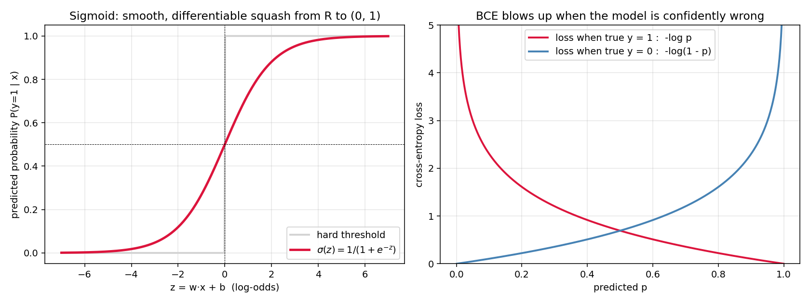
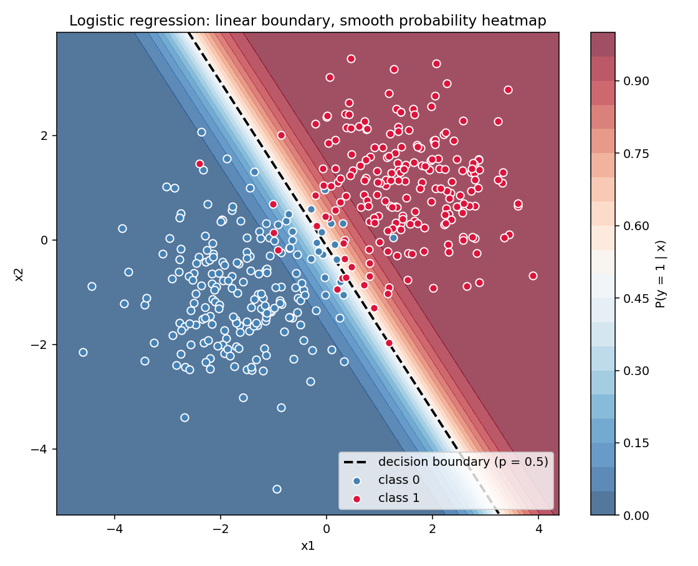

# 02 — Logistic Regression

> Goal: derive binary cross-entropy as the MLE under a Bernoulli model, then see that its gradient is `Xᵀ(σ − y)` — the cleanest gradient in ML — and implement it two ways (gradient descent, Newton/IRLS).

---

## 1. Intuition

We want to fit a line to *probabilities*, but probabilities live in `[0, 1]` and lines don't. Fix: compute a linear score `z = wᵀx + b`, then squash it through the **sigmoid** `σ(z) = 1 / (1 + e^(-z))` to land in `[0, 1]`. Train by maximizing the likelihood that the model assigns to the observed labels. The math falls out shockingly cleanly.

---

## 2. The math, derived

### 2.1 Where the sigmoid comes from (log-odds)

Define the **odds** of class 1: `odds = p / (1 − p)`. Take the log → **log-odds (logit)**: `log[p / (1 − p)]`. Model the log-odds as linear in `x`:

```
log[ p / (1 - p) ] = wᵀx + b = z
```

Solve for `p`:

```
p / (1 - p) = e^z
p = e^z / (1 + e^z) = 1 / (1 + e^(-z)) = sigma(z)
```

The sigmoid isn't arbitrary — it's the inverse of the logit. We *assumed* the log-odds were linear, and the sigmoid popped out.

### 2.2 Likelihood (Bernoulli MLE)

For one sample with label `yᵢ ∈ {0, 1}` and predicted probability `σᵢ = σ(wᵀxᵢ + b)`:

```
P(y_i | x_i, w) = sigma_i^{y_i} (1 - sigma_i)^{1 - y_i}
```

Log-likelihood across `n` samples:

```
log L(w) = sum_i [ y_i log sigma_i + (1 - y_i) log(1 - sigma_i) ]
```

Negate to get the loss we minimize — **binary cross-entropy**:

```
L(w) = - (1/n) sum_i [ y_i log sigma_i + (1 - y_i) log(1 - sigma_i) ]
```

### 2.3 The gradient (the magic moment)

Useful sigmoid identities:

```
sigma'(z)              = sigma(z) (1 - sigma(z))
d/dz [ log sigma(z) ]  = 1 - sigma(z)
d/dz [ log(1 - sigma(z)) ] = - sigma(z)
```

Apply the chain rule to one sample's loss with `zᵢ = wᵀxᵢ + b`:

```
dL_i / dw = - [ y_i (1 - sigma_i) - (1 - y_i) sigma_i ] x_i
          = - [ y_i - sigma_i ] x_i
          = (sigma_i - y_i) x_i
```

Stacking samples:

```
grad_w L = (1/n) Xᵀ ( sigma(X w) - y )
```

Compare with linear regression (module 01): `(2/n) Xᵀ (Xw − y)`. Same shape — `Xᵀ · residual` — and that's not a coincidence. Any model with a linear score + canonical link function under the exponential family has this form. (One of the *patterns* the course earns.)

Gradient-descent update:

```
w_{t+1} = w_t - eta * (1/n) Xᵀ ( sigma(X w_t) - y )
```

### 2.4 Newton's method = IRLS

The Hessian, derived once:

```
H = (1/n) Xᵀ S X         where  S = diag( sigma_i (1 - sigma_i) )
```

`S` is diagonal and positive ⇒ `L` is convex ⇒ Newton's step always points downhill:

```
w_{t+1} = w_t - H^{-1} grad_w L
        = w_t + (Xᵀ S X)^{-1} Xᵀ (y - sigma)
```

This is **iteratively reweighted least squares (IRLS)**. Converges in ~5–10 iterations for well-conditioned problems. Costs `O(d³)` per step.

---

## 3. Diagrams

| Script | Shows |
|---|---|
| `diagram_sigmoid.py` | The sigmoid curve, hard threshold for comparison, and binary cross-entropy loss as a function of predicted probability |
| `diagram_decision_boundary.py` | 2D classification: data colored by class, probability heatmap behind, learned decision boundary as a line |

Regenerate:
```powershell
python diagram_sigmoid.py
python diagram_decision_boundary.py
```





---

## 4. Mind-map: classification family

```mermaid
graph LR
  Logit[Log-odds<br/>= wᵀx + b] --> Sigmoid[Sigmoid<br/>squash to 0..1]
  Sigmoid --> BCE[Binary Cross-Entropy<br/>MLE of Bernoulli]
  BCE --> GD[Gradient Descent<br/>O(n d) / step]
  BCE --> IRLS[Newton / IRLS<br/>O(d³) / step, ~10 steps]
  Sigmoid --> Soft[Softmax<br/>K-class generalization]
  Soft --> CCE[Categorical Cross-Entropy]
  BCE --> Reg[+ L2 / L1 penalty<br/>module 03]
  Logit --> SVM[Hinge loss<br/>SVM, module 04]
  Sigmoid --> NN[Final layer<br/>of a binary neural net<br/>module 10]
```

Everything here is a variation on *linear score → loss function*. Linear regression uses MSE; logistic uses cross-entropy; SVM uses hinge; softmax extends to K classes. The optimizers and the diagnostics carry across.

---

## 5. From scratch

`from_scratch.py` implements:

- `LogisticRegressionGD` — gradient descent on cross-entropy.
- `LogisticRegressionNewton` — IRLS using the Hessian above.

Both train on the same synthetic 2D dataset (two Gaussian blobs with overlap). The script asserts the two solutions agree to within `1e-2` and prints train/test accuracy. No scikit-learn in the core loop.

Run:
```powershell
python from_scratch.py
```

Implementation notes you'll see in the code:
- **Numerically stable log-loss**: never compute `log(sigma)` directly when `sigma` is near 0. Use `log1p(−sigma)` and friends.
- **Sigmoid overflow**: `1 / (1 + exp(-z))` blows up for `z << 0`. Branch the computation or use `np.where`.

---

## 6. When to use / when it breaks

**Use when:**
- Binary (or, via softmax, multi-class) classification with roughly linearly separable classes after feature engineering.
- You need calibrated probabilities, not just labels. Logistic regression's outputs *are* probabilities (well-calibrated MLE under the model).
- You need an interpretable baseline. Each weight is the change in log-odds per unit increase in that feature.

**Breaks when:**
- Classes are perfectly separable. The MLE has no finite solution — weights blow up to ±∞. Fix: regularize (module 03).
- Severe class imbalance. The model learns "always predict majority". Fix: class weights, resampling, threshold tuning.
- True boundary is non-linear and you didn't engineer features for it. Fix: kernel SVM (module 04), trees (module 05), neural nets (module 10).
- Strongly correlated features. Weights become unstable; their individual interpretation becomes meaningless even though predictions stay accurate.

---

## 7. References

- Bishop — *Pattern Recognition and Machine Learning*, §4.3.
- Andrew Ng — CS229 Notes 1, §5–6 (the cleanest written derivation of logistic regression and the cross-entropy gradient anywhere).
- Hastie, Tibshirani, Friedman — *Elements of Statistical Learning*, §4.4.
- StatQuest — *Logistic Regression, Clearly Explained* (YouTube).
