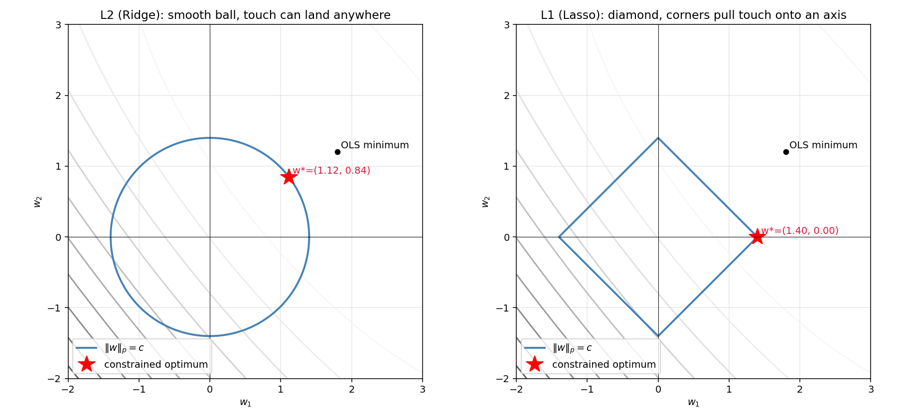
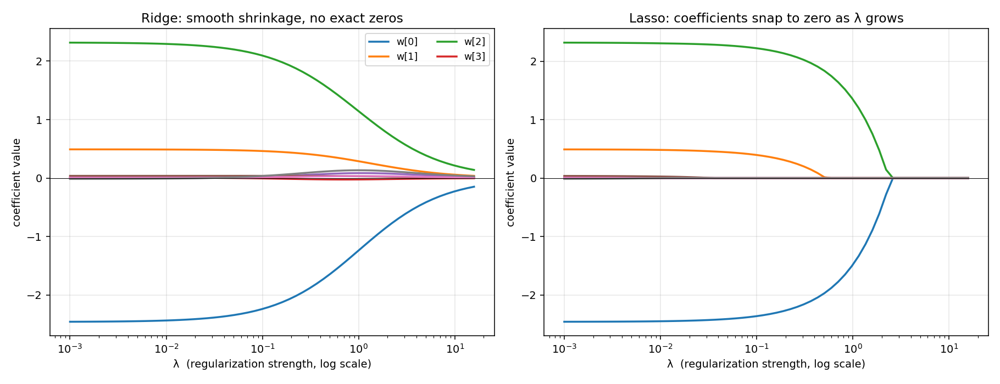
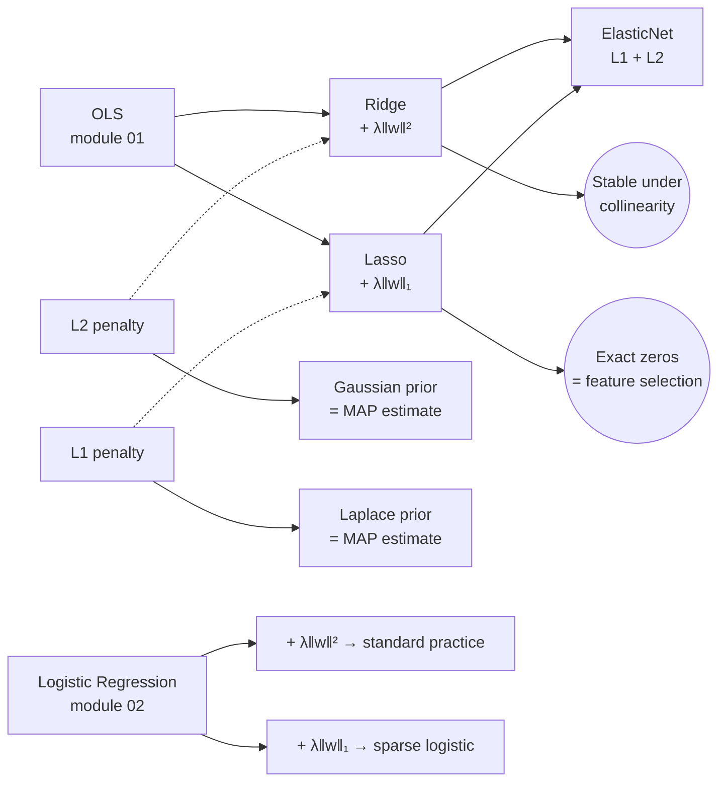

# 03 — Regularization (Ridge, Lasso, ElasticNet)

> Goal: understand why adding a tiny penalty to the loss cures overfitting and collinearity. Derive Ridge's closed form. Derive Lasso's coordinate-descent update from the soft-thresholding operator — and see why L1 produces *exact* zeros while L2 only shrinks.

---

## 1. Intuition

OLS minimizes squared error. If features are collinear or `n < d`, infinitely many solutions tie for the lowest error — OLS picks one with arbitrarily huge weights. Regularization adds a *cost on weight size* so the optimizer prefers small, stable weights. The form of that cost changes the shape of the answer:

- **L2 (Ridge)**: pay `λ · w_j²` per weight. Pushes every weight gently toward zero. Smooth.
- **L1 (Lasso)**: pay `λ · |w_j|` per weight. Pushes small weights *all the way to* zero. Sparse.
- **ElasticNet**: pay a mix of both. Sparsity plus stability when features are correlated.

---

## 2. The math, derived

Stacked notation as before: `X ∈ ℝⁿˣᵈ`, `y ∈ ℝⁿ`, `w ∈ ℝᵈ`. (Intercept is centered out — standardize first.)

### 2.1 Ridge — closed form

```
L_ridge(w) = ‖X w - y‖² + λ ‖w‖²
```

Gradient:

```
grad L = 2 Xᵀ (X w - y) + 2 λ w
```

Set to zero:

```
Xᵀ X w + λ w = Xᵀ y
(Xᵀ X + λ I) w = Xᵀ y

w* = (Xᵀ X + λ I)^{-1} Xᵀ y
```

`Xᵀ X` may be singular. `Xᵀ X + λI` never is (for `λ > 0`) — adding `λ` to every eigenvalue lifts the matrix away from zero. That single line is *why Ridge cures collinearity*.

**Bayesian view**: this is the MAP estimate of `w` under a Gaussian prior `w ~ N(0, σ²/λ · I)`. L2 = Gaussian belief that weights are small. (Pattern: every loss/penalty pair in this course is some MLE/MAP under some prior.)

### 2.2 Lasso — coordinate descent + soft-thresholding

```
L_lasso(w) = (1/2) ‖X w - y‖² + λ ‖w‖_1
```

No closed form: `|w_j|` isn't differentiable at zero. But there's a clean trick — **coordinate descent**: minimize over one weight at a time with the rest held fixed. The 1D subproblem has a closed form.

Holding `w_k` fixed for `k ≠ j`, define the partial residual `r_j = y − Σ_{k≠j} x_k w_k`. The subproblem in `w_j` becomes (after assuming columns of X are standardized so `‖x_j‖² = 1`):

```
minimize  (1/2) (w_j - rho_j)² + λ |w_j|       where  rho_j = x_jᵀ r_j
```

The minimizer is the **soft-thresholding operator**:

```
w_j = S_λ(rho_j) = sign(rho_j) · max(|rho_j| - λ, 0)
```

#### Why `S_λ` produces exact zeros

Take the subgradient of `(1/2)(w − ρ)² + λ|w|`:

- If `w > 0`: derivative is `(w − ρ) + λ = 0` ⇒ `w = ρ − λ`, valid when `ρ > λ`.
- If `w < 0`: derivative is `(w − ρ) − λ = 0` ⇒ `w = ρ + λ`, valid when `ρ < −λ`.
- If `w = 0`: 0 is in the subdifferential `[−ρ − λ, −ρ + λ]` iff `|ρ| ≤ λ`.

So when `|ρ| ≤ λ`, the optimal `w_j` is *exactly zero*. The corner of `|w|` at `0` "snaps" the solution to that corner. This is the algebraic origin of sparsity.

**Algorithm**: cycle through coordinates `j = 1..d` and apply `S_λ` until convergence.

**Bayesian view**: MAP under a Laplace prior `w ~ Laplace(0, 1/λ)`. Heavier tails → more weights at exactly zero.

### 2.3 ElasticNet

```
L_en(w) = (1/2) ‖X w - y‖² + λ_1 ‖w‖_1 + (λ_2 / 2) ‖w‖²
```

Same coordinate-descent strategy with a tweaked update:

```
w_j = S_{λ_1}(rho_j) / (1 + λ_2)
```

Best of both — sparsity from L1, stability under correlated features from L2.

---

## 3. Diagrams

| Script | Shows |
|---|---|
| `diagram_penalty_geometry.py` | The classic picture: OLS contour ellipse + L2 ball (smooth) + L1 diamond (corners on the axes) + where each constraint touches the contour |
| `diagram_weight_paths.py` | Coefficients vs `λ` for Ridge and Lasso. Ridge shrinks smoothly to zero; Lasso snaps each coefficient to zero one by one. |

Regenerate:
```powershell
python diagram_penalty_geometry.py
python diagram_weight_paths.py
```





The L1 diamond has corners on the axes. The OLS contour ellipse most often *touches the diamond at a corner* — and at a corner, some `w_j = 0`. That's the geometry behind the algebra. The L2 ball is smooth, the touch point can land anywhere, no coefficient gets to exactly zero.

---

## 4. Mind-map: linear models + penalties



The recipe generalizes: pick a loss, add a penalty, get a regularized estimator. Cross-entropy + L2 is what scikit-learn's `LogisticRegression` does by default.

---

## 5. From scratch

`from_scratch.py` implements:

- `RidgeClosedForm` — one-line `solve((XᵀX + λI), Xᵀy)`.
- `LassoCoordinateDescent` — cycles through coordinates, applies `S_λ`.
- `ElasticNetCoordinateDescent` — same loop, slightly different update.

The script runs all three on a synthetic dataset where only `3` of `20` true features matter. Lasso recovers the sparse support; Ridge does not. Lasso prints the exact zero-count.

Run:
```powershell
python from_scratch.py
```

---

## 6. When to use / when it breaks

**Ridge**:
- Use when: many features are mildly correlated; you don't care about sparsity; you want stable estimates.
- Breaks when: you wanted to know *which* features matter (it never zeros them).

**Lasso**:
- Use when: you suspect most features don't matter; you want feature selection baked in.
- Breaks when: groups of correlated features (Lasso arbitrarily picks one and zeros the rest); when `λ` is too high it zeros everything; computationally heavier than Ridge.

**ElasticNet**:
- Use when: correlated features + want sparsity. The "do both" choice.
- Breaks when: you have to tune *two* hyperparameters now (`λ_1`, `λ_2`).

**For all three**: standardize features first (subtract mean, divide by std). The penalty `λ‖w‖²` punishes the *magnitude* of weights — if features live on different scales, you're penalizing them unequally. Standardize → fair comparison.

---

## 7. References

- Tibshirani — *Regression Shrinkage and Selection via the Lasso* (1996). The original Lasso paper. Short and readable.
- Friedman, Hastie, Tibshirani — *Regularization Paths for Generalized Linear Models via Coordinate Descent* (2010). The paper behind `glmnet`. Cleanest coordinate-descent derivation.
- ESL §3.4 — geometric picture of Ridge vs Lasso.
- Zou & Hastie — *Regularization and Variable Selection via the Elastic Net* (2005).
