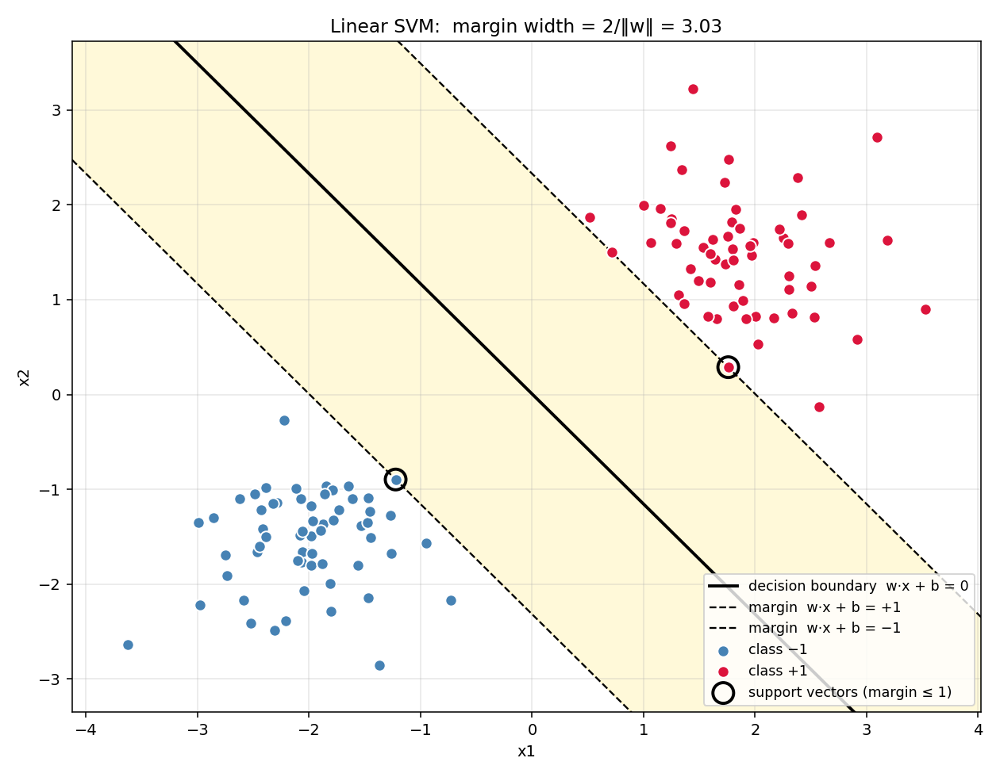
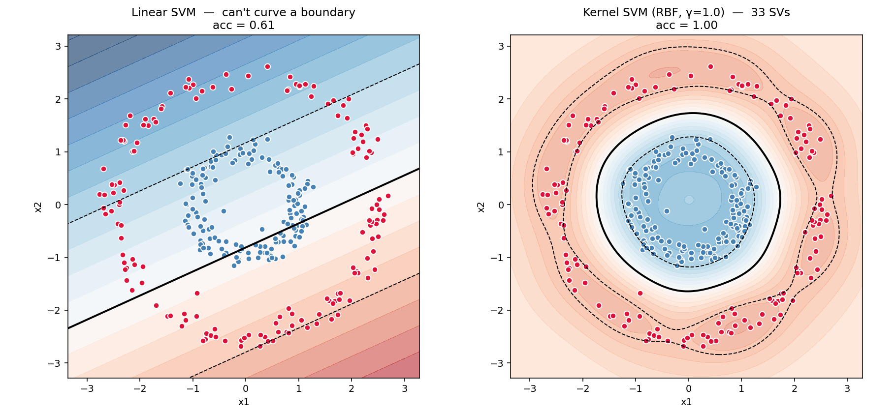
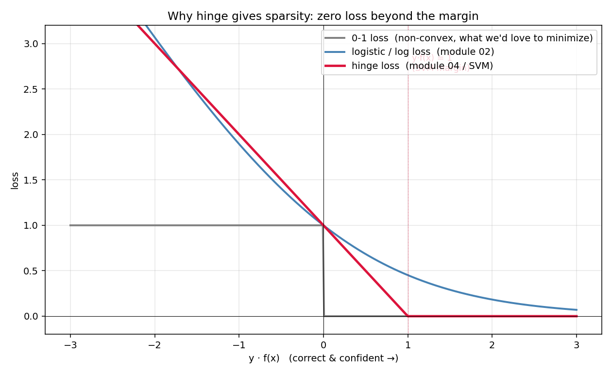
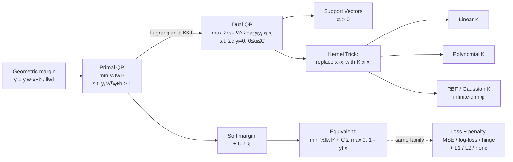

# 04 — Support Vector Machines

> Goal: derive the max-margin classifier in full. Start with the geometry of the margin, get to the primal QP, convert it to the dual via Lagrange multipliers, watch the kernel trick emerge for free, and recognize the equivalent hinge-loss form so SVMs join the rest of the linear-models family.

This module is the longest derivation in the course. It's worth it — every line below earns its keep.

---

## 1. Intuition

Among all hyperplanes that separate two classes, pick the one that's as far from *both* sides as possible. The width of the empty buffer is the **margin**. The points sitting on the edge of the buffer are the only ones that matter — they are the **support vectors**. Move any other point, the boundary doesn't move. That's the whole idea.

---

## 2. The math, derived

Labels are `yᵢ ∈ {−1, +1}` (not 0/1 — sign-symmetric labels make the algebra cleaner).

### 2.1 Margin: functional and geometric

A hyperplane is `{x : wᵀx + b = 0}`. For a correctly-classified point `xᵢ`:

```
functional margin :  γ̂ᵢ = yᵢ (wᵀxᵢ + b)        (positive when classified right)
geometric margin  :  γᵢ  = yᵢ (wᵀxᵢ + b) / ‖w‖   (signed distance to the plane)
```

Scaling `(w, b) → (cw, cb)` multiplies the functional margin by `c` but leaves the geometric margin unchanged. That symmetry will let us pin down a canonical `(w, b)`.

### 2.2 Primal (hard margin)

We want to maximize the smallest geometric margin:

```
maximize   γ
subject to  yᵢ(wᵀxᵢ + b) / ‖w‖ ≥ γ,   for all i
```

**Trick**: scale `(w, b)` so the smallest functional margin equals exactly 1. Then `γ = 1/‖w‖`. Maximizing `1/‖w‖` is minimizing `½‖w‖²` (squared for convexity, half for a clean gradient):

```
minimize   ½‖w‖²
subject to  yᵢ(wᵀxᵢ + b) ≥ 1,   for all i
```

This is a **convex quadratic program**. Beautiful, but its real power shows up only after we look at its **dual**.

### 2.3 Lagrangian → dual

Introduce one multiplier `αᵢ ≥ 0` per constraint:

```
L(w, b, α) = ½‖w‖² - Σᵢ αᵢ [ yᵢ(wᵀxᵢ + b) - 1 ]
```

Minimize over `w, b` (set partials to zero):

```
∂L/∂w = w - Σᵢ αᵢ yᵢ xᵢ = 0     ⇒   w = Σᵢ αᵢ yᵢ xᵢ      (*)
∂L/∂b = -Σᵢ αᵢ yᵢ = 0           ⇒   Σᵢ αᵢ yᵢ = 0         (**)
```

Equation (*) is striking: **the optimal weight vector is a weighted sum of the training inputs**. Plug (*) and (**) back into `L` and simplify (algebra below the fold) — every `b` term cancels, and you're left with the **dual**:

```
maximize    W(α) = Σᵢ αᵢ - ½ Σᵢ Σⱼ αᵢ αⱼ yᵢ yⱼ (xᵢ·xⱼ)
subject to   Σᵢ αᵢ yᵢ = 0,   αᵢ ≥ 0
```

Two consequences worth pausing on:

1. **The dual depends on the data only through the inner products `xᵢ·xⱼ`.** This is what makes the kernel trick possible.
2. **Most `αᵢ` will be zero.** By KKT complementary slackness, `αᵢ · [yᵢ(wᵀxᵢ + b) − 1] = 0`. Either the point is *strictly inside* its half-space (margin > 1, so `αᵢ = 0`), or it sits *exactly on the margin* (then `αᵢ ≥ 0` is free). Those few points with `αᵢ > 0` are the **support vectors**.

### 2.4 Support vectors and the bias

After solving the dual, recover:

```
w = Σ_{i ∈ SV} αᵢ yᵢ xᵢ
b = yₛ - wᵀxₛ           for any support vector xₛ (numerically: average over all SVs)
```

To predict on a new `x`:

```
f(x) = sign( wᵀx + b ) = sign( Σ_{i ∈ SV} αᵢ yᵢ (xᵢ·x) + b )
```

Notice — *prediction* also only uses inner products. The next move writes itself.

### 2.5 Kernel trick

Pick a feature map `φ : ℝᵈ → H` (possibly into a very high-dimensional space). Replace every `xᵢ·xⱼ` with `φ(xᵢ)·φ(xⱼ)`. Define the **kernel**:

```
K(xᵢ, xⱼ) = φ(xᵢ) · φ(xⱼ)
```

Now the dual is the same problem in `H`:

```
W(α) = Σᵢ αᵢ - ½ Σᵢ Σⱼ αᵢ αⱼ yᵢ yⱼ K(xᵢ, xⱼ)
```

**Key point**: we never compute `φ(x)` explicitly. If `K` can be evaluated cheaply, the SVM operates in the high-dimensional `H` for free. **Mercer's condition** says any symmetric, positive-semidefinite function `K(·, ·)` corresponds to some valid `φ`.

Common kernels:

| Kernel | Formula | What it learns |
|---|---|---|
| Linear | `xᵀx'` | Hyperplane in input space |
| Polynomial (degree `d`) | `(xᵀx' + c)^d` | Polynomial decision boundaries |
| RBF (Gaussian) | `exp(-γ ‖x − x'‖²)` | Smooth, locally non-linear boundaries — *infinite-dimensional* feature space |
| Sigmoid | `tanh(α xᵀx' + c)` | Less common, related to neural nets |

### 2.6 Soft margin: slack variables

Real data isn't perfectly separable. Allow each point to violate the margin by `ξᵢ ≥ 0`, but pay for it:

```
minimize   ½‖w‖² + C Σᵢ ξᵢ
subject to  yᵢ(wᵀxᵢ + b) ≥ 1 - ξᵢ,    ξᵢ ≥ 0
```

`C` is the cost knob. Large `C` → small slacks → narrow margin (overfit risk). Small `C` → big slacks → wider margin (underfit risk).

The Lagrangian dance lands at the same dual with one extra constraint:

```
0 ≤ αᵢ ≤ C
```

Everything else is unchanged. **C clips α from above.**

### 2.7 The hinge-loss form (SVM joins the loss-function family)

Eliminate the slacks from the soft-margin primal by noting `ξᵢ = max(0, 1 - yᵢ(wᵀxᵢ + b))`. The primal becomes:

```
minimize   ½‖w‖² + C Σᵢ max(0, 1 - yᵢ(wᵀxᵢ + b))
```

That second term is **hinge loss**. So SVM = (L2 regularization) + (hinge loss). Sister to:

- Linear regression = (no penalty) + MSE.
- Ridge = (L2) + MSE.
- Logistic regression = (no penalty) + log-loss.
- Logistic + L2 = (L2) + log-loss.
- **SVM = (L2) + hinge loss.**

The pattern across modules 01–04 is now visible: pick a loss, add a penalty, you have a linear model.

---

## 3. Diagrams

| Script | Shows |
|---|---|
| `diagram_margin.py` | Linearly separable data, the decision hyperplane, the two parallel margin lines at `±1`, and the support vectors highlighted |
| `diagram_kernel.py` | Concentric-rings data. Linear SVM fails (impossible boundary). RBF kernel SVM carves a clean circular boundary |
| `diagram_hinge_loss.py` | Hinge vs log-loss vs 0-1 loss as functions of `y·f(x)` — why hinge gives sparse solutions (zero loss beyond margin) |

Regenerate:
```powershell
python diagram_margin.py
python diagram_kernel.py
python diagram_hinge_loss.py
```







---

## 4. Mind-map: SVM and the kernel-methods family



---

## 5. From scratch

`from_scratch.py` implements:

- `LinearSVM` — soft-margin primal solved by **subgradient descent on the hinge loss** (Pegasos-style). Simple, scales linearly with `n`.
- `KernelSVM` — soft-margin dual solved by **simplified SMO** (Platt's simplified version, ~40 lines). Supports linear, polynomial, and RBF kernels. Tracks support vectors.

The script runs:
1. `LinearSVM` on linearly separable blobs → finds the max-margin hyperplane.
2. `KernelSVM` with RBF on a non-separable rings dataset → finds a curved boundary that linear couldn't.

Both report accuracy and number of support vectors.

Run:
```powershell
python from_scratch.py
```

---

## 6. When to use / when it breaks

**Use when:**
- Medium-sized data (`n ≤ ~10⁴`) with a clear margin geometry.
- Non-linear boundaries via RBF when you don't want to engineer features yourself.
- You need a sparse representation (only support vectors matter at inference).
- Clean theoretical guarantees matter — margin theory gives generalization bounds.

**Breaks when:**
- Large `n`. The kernel matrix is `n × n` — memory blows up past ~10⁵ samples. (Modern fix: linear SVM, kernel approximation, or just switch to gradient-boosted trees / neural nets.)
- Multi-class needs one-vs-rest or one-vs-one wrappers — no native multi-class formulation.
- Probabilities aren't native. Platt scaling fits a sigmoid on top after training; calibration is mediocre vs logistic regression.
- Features must be on similar scales — RBF distances are unforgiving. **Always standardize.**
- Hyperparameter sensitivity: `(C, γ)` for RBF needs grid search.

---

## 7. References

- Burges — *A Tutorial on Support Vector Machines for Pattern Recognition* (1998). Still the gold-standard pedagogical paper.
- Bishop — *PRML*, §7.1. Cleanest treatment of the dual derivation.
- Andrew Ng — CS229 Notes 3 (SVM). Pairs well with Bishop.
- Platt — *Sequential Minimal Optimization* (1998). The original SMO paper.
- Shalev-Shwartz et al. — *Pegasos: Primal Estimated sub-GrAdient SOlver for SVM* (2007). The primal-subgradient approach we use in `LinearSVM`.
