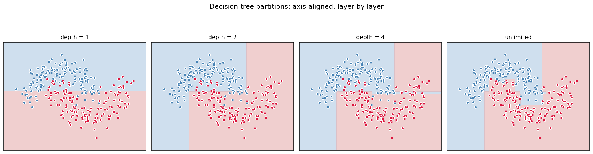
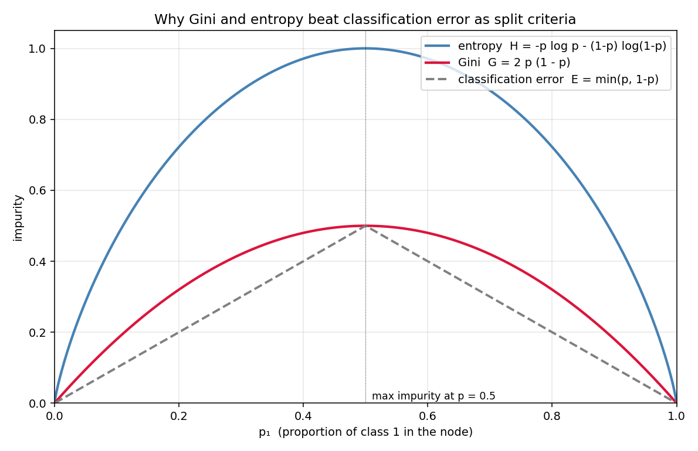

# 05 — Decision Trees

> Goal: see why a greedy, top-down, *axis-aligned* split on the "best" feature is a viable algorithm at all — and what "best" formally means via Gini and entropy.

A shift in flavor from modules 01–04: there's no convex loss surface here, no gradient. The algorithm is purely combinatorial — search over splits, pick the best. The whole module is about answering "best how?"

---

## 1. Intuition

Ask one yes/no question at a time. The first question should be the most informative one — the one that most cleanly separates the classes. Then ask the most informative *follow-up* question given the answer. Repeat until each surviving group is pure enough to assign a single label. Geometrically: chop the feature space with axis-aligned cuts until each rectangle holds one class.

---

## 2. The math: impurity, information gain, greedy splits

### 2.1 Impurity measures

A node holds a set of samples with class proportions `p_k = #{class k} / #samples`. We want a number that says how "mixed up" the node is — zero when pure, large when balanced.

**Gini impurity**

```
G = sum_k p_k (1 - p_k) = 1 - sum_k p_k^2
```

Interpretation: if you label a sample by drawing a random class from the distribution `p`, this is the probability of being wrong. Quadratic in `p`. Smooth.

**Entropy**

```
H = - sum_k p_k log_2 p_k
```

Interpretation: the average number of bits needed to encode a sample's class. Log-shaped, so flatter near `p = 0.5`.

**Classification error**

```
E = 1 - max_k p_k
```

Used in pruning but a *bad* split criterion — it's piecewise linear and ignores small movements in `p` that don't change the majority class. Gini and entropy don't have that blind spot.

For 2-class problems, Gini and entropy both peak at `p_1 = 0.5` (max impurity) and hit zero at `p_1 = 0` or `1` (pure). They almost always rank candidate splits the same way — so you'll see both used interchangeably.

For **regression**, the analogous impurity is variance / MSE:

```
I_MSE = (1/n) sum_i (y_i - ȳ)^2
```

### 2.2 Information gain

A split sends samples to a left child (`n_L`) and a right child (`n_R = n - n_L`). The **gain** is the impurity *drop*:

```
IG(split) = I(parent) - [ (n_L / n) I(left)  +  (n_R / n) I(right) ]
```

The weighting by child size matters — a split that produces a tiny pure node and one almost-as-impure-as-the-parent node should not be celebrated.

### 2.3 The greedy CART algorithm

```
build(samples):
    if stopping_criterion: return Leaf(majority_class(samples))
    best_feature, best_threshold = argmax over all (j, t) of IG(split on x_j <= t)
    left  = samples where x_j <= best_threshold
    right = samples where x_j  > best_threshold
    return Node(best_feature, best_threshold,
                build(left), build(right))
```

For `n` samples and `d` features, evaluating *all* candidate thresholds at a node is `O(n · d · log n)` if you sort each feature once at the root and maintain order, or `O(n · d)` per node naively (which is what we'll do — clarity over speed).

**Why greedy?** Finding the globally optimal tree is NP-hard. Greedy isn't optimal — it can miss "compound" splits where two features *together* discriminate but neither alone does (XOR-style patterns). The fix isn't a smarter search; it's an *ensemble* of greedy trees (module 06).

### 2.4 Stopping criteria

Without any, the tree grows until each leaf has one sample — perfect train accuracy, garbage generalization. Common stops:

- `max_depth` — most popular knob.
- `min_samples_split` — don't split a node smaller than this.
- `min_samples_leaf` — don't create a leaf smaller than this.
- `min_impurity_decrease` — only split if `IG > threshold`.

### 2.5 Pruning (cost-complexity)

Grow a deep tree, then chop subtrees that don't justify their complexity. Cost-complexity functional:

```
C_alpha(T) = misclassification(T) + alpha · |T|
```

`alpha` is a penalty per leaf. For each `alpha`, there's an optimal pruned subtree, and they form a nested sequence `T_0 ⊃ T_1 ⊃ ...`. Pick `alpha` by cross-validation. In modern practice, `max_depth` is so much easier that pruning is rarely done outside of textbooks.

---

## 3. Diagrams

| Script | Shows |
|---|---|
| `diagram_partitions.py` | A 2D classification dataset; how the tree partitions the plane into axis-aligned rectangles at depths 1, 2, 3, and unconstrained |
| `diagram_impurity.py` | Gini, entropy, and classification error as functions of `p₁` for binary classification — visualizes why error makes a worse split criterion |

Regenerate:
```powershell
python diagram_partitions.py
python diagram_impurity.py
```





---

## 4. Mind-map: tree-based methods

```mermaid
graph LR
  DT[Decision Tree<br/>module 05] --> Impurity[Impurity measures]
  Impurity --> Gini[Gini  1 - Σpₖ²]
  Impurity --> Ent[Entropy  -Σpₖ log pₖ]
  Impurity --> MSE[MSE  for regression]
  DT --> Greedy[Greedy CART:<br/>argmax IG over feature × threshold]
  DT --> Stop[Stopping rules:<br/>max_depth, min_samples, min_gain]
  DT --> Prune[Cost-complexity pruning<br/>C α = err + α·|T|]
  DT -.high variance.-> Bag[Bagging → RF<br/>module 06]
  DT -.boosting.-> Boost[AdaBoost / GBM<br/>module 06]
  DT --> Cat[Categorical features<br/>native, no encoding]
  DT --> Interp[Interpretable<br/>printable rules]
  DT -.no scaling.-> Scale[Scale-invariant<br/>axis-aligned splits]
```

The two arrows out of "Decision Tree" — *high variance* leads to bagging/Random Forest, *low bias when added together* leads to boosting. Both lines lead into module 06.

---

## 5. From scratch

`from_scratch.py` implements `DecisionTreeClassifier`:

- Gini impurity by default (entropy available as a flag).
- Greedy CART recursion with axis-aligned splits.
- Configurable `max_depth`, `min_samples_split`, `min_impurity_decrease`.
- A `print_tree()` method that dumps the learned rules in human-readable form.

The script:
1. Generates a 2D dataset where the true boundary is non-linear (two interleaved moons).
2. Trains trees at depth 1, 2, 4, and unlimited. Reports train/test accuracy.
3. Prints the learned tree at depth 3 so you can read off the rules.

Run:
```powershell
python from_scratch.py
```

Expected: deeper tree → higher train accuracy, gap with test accuracy grows (overfitting). The depth-1 tree achieves chance accuracy; depth 4 nails it.

---

## 6. When to use / when it breaks

**Use when:**
- You want a fast, interpretable baseline.
- Features are a mix of numeric and categorical — no scaling, no one-hot needed.
- You care about which features matter (feature importance from impurity decrease).
- You need a model that's easy to explain to a non-technical stakeholder.

**Breaks when:**
- The true boundary is *rotated* (not aligned with axes). Trees need many steps to approximate a diagonal line — wasteful.
- Tiny data changes restructure the whole tree. Decision trees have notoriously high variance.
- XOR / parity problems. Greedy splits can't see compound structure.
- Probabilities are needed and well-calibrated. Tree leaves give crude `n_class / n_total` estimates.

The first two failure modes are exactly what motivates **ensembles** in module 06: average many trees → variance drops dramatically.

---

## 7. References

- Breiman, Friedman, Olshen, Stone — *Classification and Regression Trees* (1984). The CART book. The original.
- Quinlan — *C4.5: Programs for Machine Learning* (1993). The other classic (uses entropy/info-gain ratio).
- ESL §9.2.
- StatQuest — *Decision Trees, Clearly Explained* (YouTube). Excellent visual intro.
