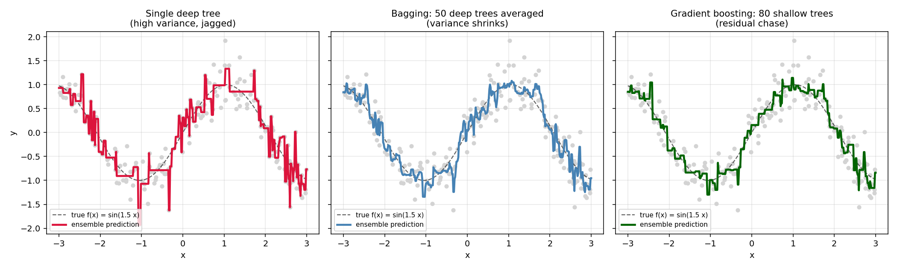
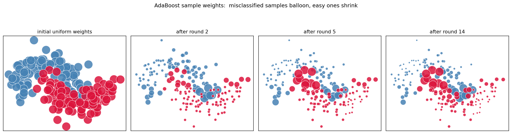
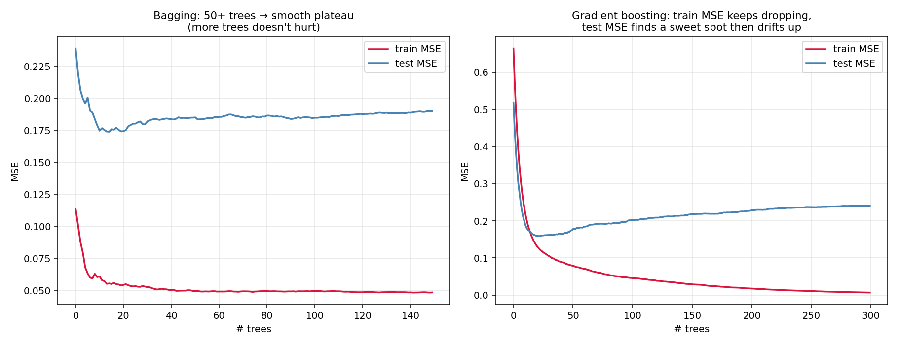
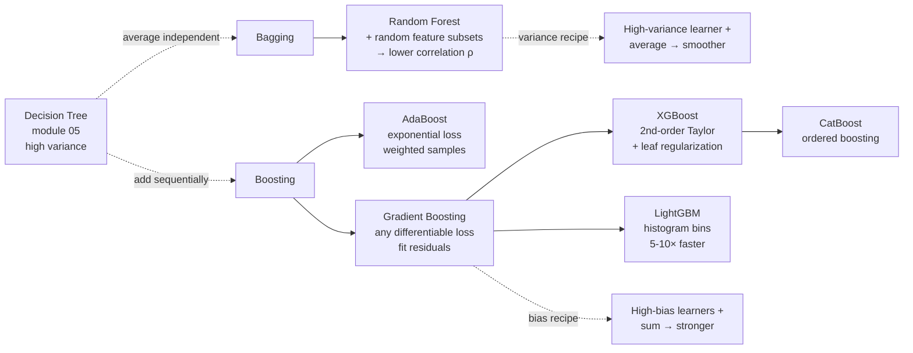

# 06 — Ensembles (Bagging, Random Forest, AdaBoost, Gradient Boosting)

> Goal: derive *why* combining many imperfect learners beats one careful learner — and see the two distinct mechanisms (variance reduction vs bias reduction) crisply enough to know which to reach for.

This module is the most important so far. Decision trees on their own (module 05) are mediocre. *Trees in an ensemble* are the workhorse of tabular ML for two decades.

---

## 1. Intuition

Two recipes, opposite philosophies:

- **Bagging** (Random Forest): train many independent trees on bootstrap samples of the data, average their predictions. Each tree is high-variance and gets a lot of things wrong — but their *errors are uncorrelated*, so the average smooths out. Reduces *variance*.
- **Boosting** (AdaBoost, GBM): train a sequence of weak learners, each one focused on the mistakes of the previous ensemble. Each learner is low-variance/high-bias on its own, but their *sum* becomes powerful. Reduces *bias*.

If your model is *high variance* (overfits): bag it. If your model is *high bias* (underfits): boost it.

---

## 2. The math, derived

### 2.1 Why averaging reduces variance (the bagging proof)

Suppose `B` estimators `f_1, ..., f_B` are i.i.d. with mean `μ` and variance `σ²`. Their average has:

```
E[ f̄ ] = μ                   (no bias change)
Var[ f̄ ] = σ² / B            (variance shrinks by B)
```

Reality: bootstrap samples overlap, so trees are not independent — call their pairwise correlation `ρ`. Then:

```
Var[ f̄ ] = ρ σ² + (1 - ρ) σ² / B
         → ρ σ²              as B → ∞
```

Two implications:

1. **Adding more trees has diminishing returns** — the `ρ σ²` floor.
2. **Decorrelating trees lowers the floor.** This is *exactly* why Random Forest exists.

### 2.2 Random Forest = bagging + random feature subsets

At every split, only consider a random `k` of the `d` features (typically `k = √d` for classification, `d/3` for regression). This forces trees to make different choices → lower `ρ` → lower ensemble variance.

Two extra perks:

- **Out-of-bag error**: bootstrap leaves ~37% of samples unused per tree (`(1 − 1/n)^n → 1/e ≈ 0.368`). Predict each sample using only the trees that didn't see it → a free unbiased validation estimate, no held-out set needed.
- **Feature importance**: average the impurity decrease attributed to each feature across all trees.

### 2.3 AdaBoost, derived (forward stagewise + exponential loss)

AdaBoost has a magical-looking algorithm: train weak learners, upweight misclassified samples, accumulate weighted votes. Where does the algorithm come from?

**Claim**: AdaBoost is *forward stagewise additive modeling* with the **exponential loss** `L(y, f) = exp(-y f)`, applied to weak classifiers `h_t(x) ∈ {−1, +1}`.

We seek `F(x) = Σ_t α_t h_t(x)`, building it one term at a time:

```
F_t(x) = F_{t-1}(x) + α_t h_t(x)
```

At round `t`, choose `(α_t, h_t)` to minimize:

```
L_t = Σᵢ exp( -yᵢ (F_{t-1}(xᵢ) + α_t h_t(xᵢ)) )
    = Σᵢ wᵢ⁽ᵗ⁾ exp( -yᵢ α_t h_t(xᵢ) )
```

where the **sample weights** `wᵢ⁽ᵗ⁾ = exp(-yᵢ F_{t-1}(xᵢ))` are exactly what AdaBoost calls the sample weights — they emerge from the algebra, we didn't invent them.

Since `yᵢ h_t(xᵢ) ∈ {-1, +1}`:

```
L_t = e^{-α_t} · W_correct + e^{α_t} · W_wrong

      where W_wrong   = Σ_{misclassified} wᵢ⁽ᵗ⁾
            W_correct = Σ_{correct}      wᵢ⁽ᵗ⁾
```

Define the **weighted error** `εₜ = W_wrong / (W_correct + W_wrong)`. Minimize `L_t` over `α_t` (`dL/dα = 0`):

```
α_t = (1/2) log( (1 - εₜ) / εₜ )
```

And the weight update:

```
wᵢ⁽ᵗ⁺¹⁾ = wᵢ⁽ᵗ⁾ · exp( -α_t yᵢ h_t(xᵢ) )
```

Both lines are *literally* the AdaBoost update. The algorithm is the optimal coordinate-descent step on a specific loss — no hand-waving.

**Final classifier**: `F(x) = sign( Σ_t α_t h_t(x) )`.

**Why exponential loss?** Convex, smooth, and on a margin `yf > 0` it pushes confidently-correct points to *very low* loss while making confidently-wrong points *very* expensive. That's why AdaBoost focuses so aggressively on misclassified samples.

### 2.4 Gradient Boosting = forward stagewise with *any* differentiable loss

AdaBoost only works for binary classification with exponential loss. Gradient boosting (Friedman, 1999) is the generalization: pick *any* differentiable loss `L(y, f)`, fit each new learner to the *negative gradient* of the loss at the current model.

At round `t`, the **pseudo-residuals** are:

```
rᵢ⁽ᵗ⁾ = - ∂L(yᵢ, f) / ∂f  |_{f = F_{t-1}(xᵢ)}
```

For squared loss `L = ½(y - f)²`: `rᵢ⁽ᵗ⁾ = yᵢ - F_{t-1}(xᵢ)`. The pseudo-residual is *the residual*. So GBM with MSE = "iteratively fit a tree to the leftover error of the previous ensemble."

For log loss (classification): `rᵢ⁽ᵗ⁾ = yᵢ - σ(F_{t-1}(xᵢ))`.

Algorithm:

```
F_0(x) = argmin_c  Σ_i L(yᵢ, c)            // initial constant prediction
for t = 1..T:
    rᵢ⁽ᵗ⁾ = - dL/df at F_{t-1}(xᵢ)
    fit tree h_t to (xᵢ, rᵢ⁽ᵗ⁾)
    F_t(x) = F_{t-1}(x) + η · h_t(x)        // η = learning rate / shrinkage
```

`η` is the learning rate, typically `0.01 – 0.1`. Small `η` + many trees > large `η` + few trees. **Empirically the most reliable knob.**

### 2.5 XGBoost in one paragraph

XGBoost (Chen & Guestrin, 2016) is gradient boosting with two key upgrades:

1. **Second-order Taylor expansion** of the loss at each step:
   ```
   L_t ≈ Σᵢ [ gᵢ h_t(xᵢ) + ½ hᵢ h_t(xᵢ)² ]   where gᵢ = ∂L/∂f, hᵢ = ∂²L/∂f²
   ```
   The exact optimal leaf value becomes `w_j* = -G_j / (H_j + λ)` and the optimal *split gain* has a closed form — no line search needed. Much faster and more accurate per step.
2. **Leaf-level regularization** `(γ · #leaves) + (λ/2)‖w‖²` baked directly into the split criterion. Sparsity-aware, missing-value handling, column subsampling.

LightGBM (2017): same idea + histogram binning of features → 5–10× faster on big tabular data. Today's "what wins Kaggle by default."

---

## 3. Diagrams

| Script | Shows |
|---|---|
| `diagram_bagging_vs_boosting.py` | 1D regression on a noisy sin: single deep tree (jagged, overfits) vs bagged ensemble (smooth, low variance) vs gradient boosting (gradual residual fit) |
| `diagram_adaboost_weights.py` | 2D classification: how sample weights evolve across AdaBoost rounds — misclassified points balloon in size, classified points shrink |
| `diagram_loss_curves.py` | Train/test loss vs number of estimators for RF and GBM — RF plateaus, GBM eventually overfits past a sweet spot |

Regenerate:
```powershell
python diagram_bagging_vs_boosting.py
python diagram_adaboost_weights.py
python diagram_loss_curves.py
```







---

## 4. Mind-map: tree-based ensembles



The mental model: **bagging is variance medicine, boosting is bias medicine, both happen to use trees because trees are so flexibly broken in opposite directions.**

---

## 5. From scratch

`from_scratch.py` implements three ensembles, sharing minimal tree primitives:

- `RandomForestClassifier` — bag of decision trees with random feature subsampling at each split.
- `AdaBoostClassifier` — depth-1 weighted stumps with the exponential-loss `α_t` derived above.
- `GradientBoostingRegressor` — sequence of small regression trees fit to residuals, with a learning rate.

The script runs all three on appropriate datasets:
1. RF on two-moons → compare to single tree (10-tree ensemble cuts the variance dramatically).
2. AdaBoost on moons → builds up margin gradually.
3. GBM on a noisy sin → watch loss decrease per round.

Run:
```powershell
python from_scratch.py
```

---

## 6. When to use / when it breaks

**Random Forest:**
- Use when: you want a strong tabular baseline with zero tuning. Robust to noise. Fast to train.
- Breaks when: huge data + many features → memory/time. Less accurate than boosted trees on most tabular benchmarks.

**AdaBoost:**
- Use when: you want a strong simple boosting baseline. Works great on clean binary classification.
- Breaks when: noisy labels — the exponential loss obsesses over outliers (a flipped label gets enormous weight). Modern boosting libraries dominate.

**Gradient Boosting (XGBoost / LightGBM / CatBoost):**
- Use when: tabular data. Often the right answer for tabular before neural nets.
- Breaks when: very large datasets where serial tree fitting is too slow (look at histogram methods); image / text data (use CNNs / Transformers); you need a probabilistic generative model.

**For all ensembles:** they trade interpretability for accuracy. A single tree (module 05) you can read line by line; a 1000-tree ensemble you cannot. Use SHAP / partial-dependence plots if you need to *explain* an ensemble.

---

## 7. References

- Breiman — *Bagging Predictors* (1996) and *Random Forests* (2001). The Random Forest papers.
- Freund & Schapire — *A Decision-Theoretic Generalization of On-line Learning and an Application to Boosting* (1997). The AdaBoost paper.
- Friedman — *Greedy Function Approximation: A Gradient Boosting Machine* (2001). The GBM paper. The cleanest derivation in the boosting literature.
- Chen & Guestrin — *XGBoost: A Scalable Tree Boosting System* (2016).
- Ke et al. — *LightGBM: A Highly Efficient Gradient Boosting Decision Tree* (2017).
- ESL §15 (bagging and RF), §10 (boosting). The Hastie-Tibshirani treatment.
