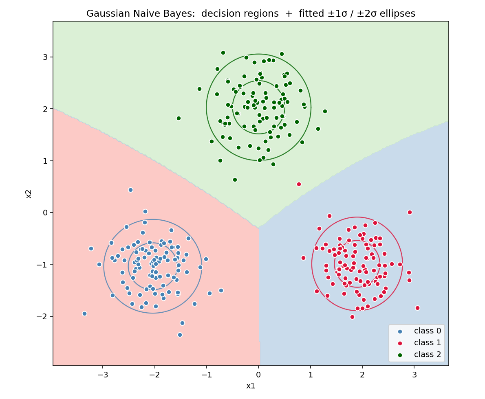
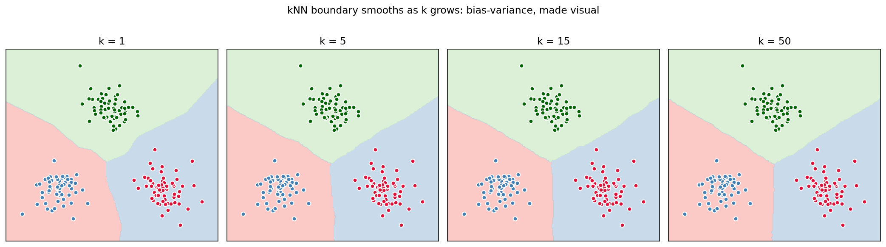
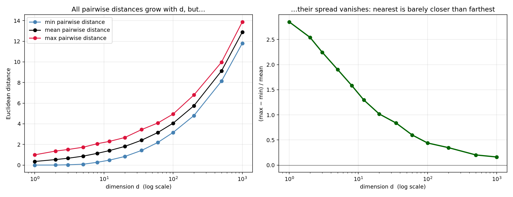

# 07 — Naive Bayes & k-Nearest Neighbours

> Goal: two baseline classifiers with almost no parameters — one parametric and probabilistic (NB), one non-parametric and geometric (kNN). Each one teaches you something the other can't.

---

## 1. Intuition

- **Naive Bayes**: model each class as a probability distribution over the feature space. Bayes' rule turns that into a classifier. The "naive" part — assuming features are *independent given the class* — is provably wrong on most data and yet *works shockingly well*, especially for text.
- **kNN**: don't model anything. To classify a new point, look at its `k` nearest training points and let them vote. All the work happens at inference time.

The contrast is instructive: NB has a *strong global model* with very few parameters. kNN has *no global model* and the whole training set is the parameters.

---

## 2. The math

### 2.1 Naive Bayes (Bayes' rule + independence)

Start with the joint distribution of features and class:

```
P(y | x) = P(x | y) P(y) / P(x)
```

The denominator `P(x)` doesn't depend on `y`, so for prediction we just need:

```
ŷ = argmax_y  P(y) · P(x | y)
```

The hard part is `P(x | y)` — a joint distribution over `d` features per class. **Naive assumption**: features are independent given the class:

```
P(x | y) = ∏_j P(x_j | y)
```

This is the assumption that's wrong on every real dataset. It collapses `d`-dimensional density estimation into `d` separate 1-dimensional problems, which is suddenly very tractable. Take logs for numerical stability:

```
ŷ = argmax_y  [ log P(y)  +  Σ_j log P(x_j | y) ]
```

#### Gaussian Naive Bayes

For continuous features, assume each `P(x_j | y)` is Gaussian:

```
P(x_j | y = c) = N(x_j ;  μ_{j,c} ,  σ²_{j,c})
```

Parameters per class `c`: mean and variance for each feature. Estimate by plain MLE on training data:

```
μ_{j,c} = (1/n_c) Σ_{i : yᵢ = c} xᵢⱼ
σ²_{j,c} = (1/n_c) Σ_{i : yᵢ = c} (xᵢⱼ - μ_{j,c})²
```

Total parameters: `2 · d · K + K`. Tiny. Trains in one pass.

#### Multinomial / Bernoulli Naive Bayes (text classification)

For count features (bag-of-words), `P(x_j | y)` is the relative frequency of word `j` in class `y`, with **Laplace smoothing** to handle unseen words:

```
P(x_j | y) = (count_{j,y} + α) / (Σ_{j'} count_{j',y} + α · d)
```

`α = 1` is the textbook default. This is the version that powers most spam filters and that beats fancier methods on small text datasets.

### 2.2 k-Nearest Neighbours

No training. At inference, for a new point `x`:
1. Compute the distance from `x` to every training point.
2. Find the `k` nearest.
3. Predict the majority class (classification) or the mean (regression).

**Distance choices:**

| Metric | Formula | Use when |
|---|---|---|
| Euclidean | `‖x - x'‖₂` | Continuous features on comparable scales |
| Manhattan | `‖x - x'‖₁` | Grid-like data or robust to outliers |
| Cosine | `1 - x·x' / (‖x‖ ‖x'‖)` | Sparse high-d data (text, embeddings) — magnitude doesn't matter |
| Hamming | `Σ 1[x_j ≠ x'_j]` | Categorical / binary features |

**Choice of k**: small `k` = low bias, high variance (sensitive to noise). Large `k` = high bias, low variance (smoother boundary). Cross-validate.

**Decision boundary geometry**: `k = 1` partitions the space into Voronoi cells — each training point owns a polygon of inputs nearest to it. Higher `k` blurs these cells together.

### 2.3 The curse of dimensionality (why kNN dies in high d)

In `d` dimensions, consider `n` random points uniform in `[0, 1]^d`. As `d → ∞`:

- Volume of the unit ball shrinks rapidly. Most data ends up in a thin shell near the boundary of the cube.
- The ratio (max distance / min distance) between point pairs approaches 1. **All points are roughly equidistant.**

A classifier that needs to find "the *nearest* neighbour" is then asking a question that no longer has a meaningful answer. Empirically, kNN's performance drops sharply for `d > ~20` unless you've reduced dimensions first (PCA, module 09).

NB doesn't suffer this — independence keeps the marginals 1-D regardless of `d`.

---

## 3. Diagrams

| Script | Shows |
|---|---|
| `diagram_nb_regions.py` | Gaussian NB on 3-class 2D data with the fitted per-class Gaussian ellipses overlaid on the decision regions |
| `diagram_knn_k.py` | kNN decision boundary for `k = 1, 5, 15, 50` on the same data — watch the boundary smooth |
| `diagram_curse.py` | Min/mean/max pairwise distance vs dimension `d`, showing distances concentrate in high dimensions |

Regenerate:
```powershell
python diagram_nb_regions.py
python diagram_knn_k.py
python diagram_curse.py
```







---

## 4. Mind-map: non-parametric and probabilistic baselines

```mermaid
graph LR
  Bayes[Bayes' Rule<br/>P y|x ∝ P x|y · P y] --> NB[Naive Bayes<br/>+ independence assumption]
  NB --> GNB[Gaussian NB<br/>continuous features]
  NB --> MNB[Multinomial NB<br/>text / counts]
  NB --> BNB[Bernoulli NB<br/>binary features]
  MNB -.+ Laplace smoothing.-> Smooth[handles unseen words]
  kNN[k-Nearest Neighbours<br/>no training] --> Dist[Distance metric]
  Dist --> Euc[Euclidean]
  Dist --> Cos[Cosine — sparse text]
  Dist --> Man[Manhattan / Hamming]
  kNN --> K[k = bias-variance knob<br/>small k → variance, large k → bias]
  kNN -.dies above d~20.-> Curse[Curse of dimensionality]
  Curse --> PCA[Fix: reduce dims first<br/>module 09]
```

---

## 5. From scratch

`from_scratch.py` implements:

- `GaussianNB` — fits per-class means and variances; log-prob inference.
- `KNeighborsClassifier` — brute-force Euclidean nearest neighbours, configurable `k`.

The script:
1. Trains both on a 3-class 2D mixture and reports test accuracy.
2. Reproduces the curse: builds uniform random points in dimensions 1, 2, 5, 10, 50, 200 and prints `(max - min) / mean` of pairwise distances. The ratio collapses toward zero as `d` grows.

Run:
```powershell
python from_scratch.py
```

---

## 6. When to use / when it breaks

**Gaussian Naive Bayes:**
- Use when: small `n`, fast baseline, continuous features that look roughly bell-shaped per class.
- Breaks when: features are strongly correlated within a class (the independence lie hurts), or when distributions are bimodal / heavy-tailed.

**Multinomial Naive Bayes:**
- Use when: text classification, bag-of-words / TF-IDF features. Still the right baseline before reaching for transformers.
- Breaks when: word order matters (use sequence models, module 13).

**kNN:**
- Use when: small `n`, low `d`, smooth decision boundary, you don't need a model artifact (only the data).
- Breaks when: high `d` (curse), large `n` (every prediction is `O(n)`), or you need calibrated probabilities.

---

## 7. References

- Bishop — *PRML* §4.2.4 (Gaussian NB), §3.3 (kNN-style nonparametric methods).
- Hastie, Tibshirani, Friedman — ESL §13.3.
- Domingos & Pazzani — *On the Optimality of the Simple Bayesian Classifier under Zero-One Loss* (1997). Explains *why* NB works so often despite the independence lie.
- Beyer et al. — *When Is "Nearest Neighbor" Meaningful?* (1999). The classic paper on the curse of dimensionality for kNN.
