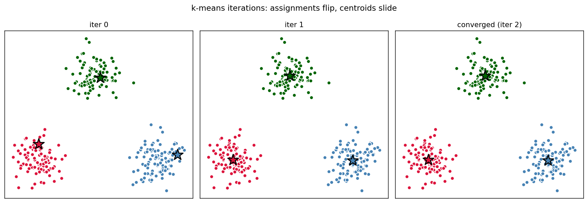
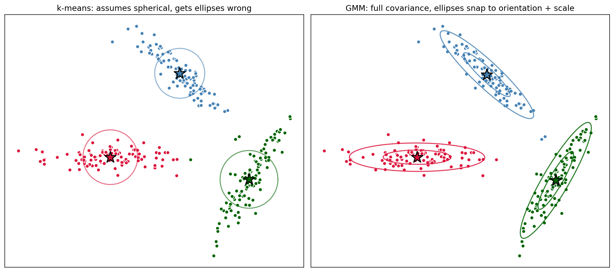
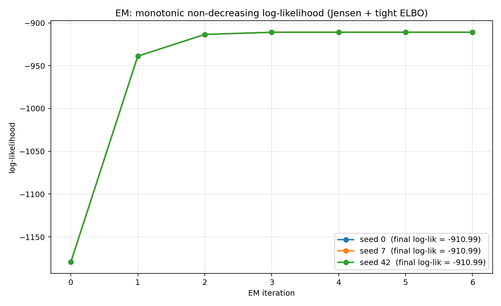
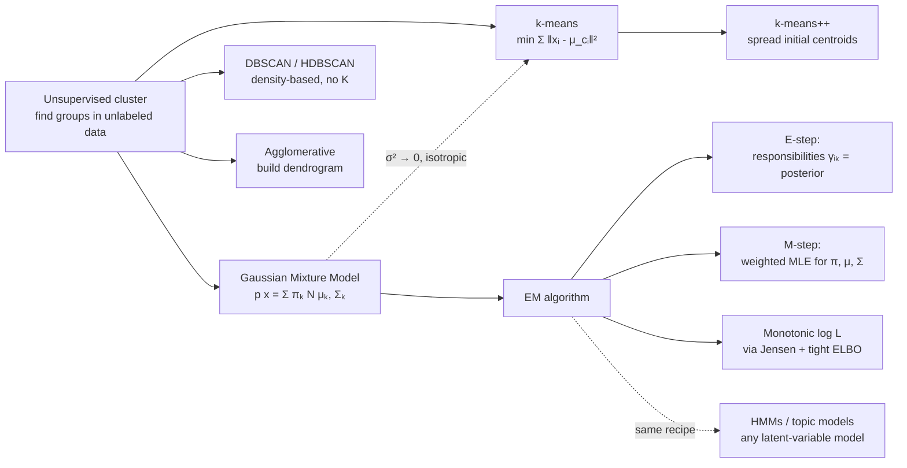

# 08 — Clustering (k-means, GMM, EM)

> Goal: derive k-means as a *hard-assignment limit* of EM on a Gaussian Mixture Model. Two algorithms, one underlying objective. The EM derivation here is the same one that powers HMMs, topic models, and the entire latent-variable family — get it once, reuse forever.

---

## 1. Intuition

You have a cloud of unlabeled points. You suspect there are `K` groups. Two approaches:

- **k-means**: assign each point to the nearest centroid, then recompute centroids as the mean of their members. Hard "this point belongs to cluster 2" assignments.
- **GMM + EM**: model each cluster as a Gaussian. Each point gets *soft* memberships — a probability of belonging to each cluster. Iterate: compute responsibilities, then update Gaussian parameters.

Spoiler: k-means is GMM-EM with the covariance constrained to be spherical *and* shrunk to zero. Same algorithm, different limit.

---

## 2. The math

### 2.1 k-means

**Objective**:

```
J(c, μ) = Σ_i ‖x_i - μ_{c_i}‖²
```

where `c_i ∈ {1, ..., K}` is the cluster assignment of `x_i` and `μ_k` is the centroid of cluster `k`.

**Algorithm** (Lloyd's algorithm) — alternate:
1. **Assignment**: `c_i ← argmin_k ‖x_i - μ_k‖²`. Each point joins its nearest centroid.
2. **Update**: `μ_k ← mean of points currently assigned to cluster k`.

This is **coordinate descent** on `J` — each step decreases `J` (or leaves it unchanged), so `J` converges. But it can land in a bad local minimum (initialization matters a lot).

**k-means++ initialization** fixes most bad-init problems:
1. Pick `μ_1` uniformly at random from the data.
2. Pick `μ_2` with probability ∝ squared distance from existing centroids.
3. Repeat until `K` centroids chosen.

Empirically the single most impactful change you can make to k-means.

### 2.2 Gaussian Mixture Model

A probabilistic model of the data:

```
p(x) = Σ_k  π_k  N(x ; μ_k, Σ_k)
```

with mixing weights `π_k ≥ 0`, `Σ π_k = 1`. Equivalently, introduce a latent variable `z_i ∈ {1, ..., K}` per sample:

```
p(z_i = k) = π_k
p(x_i | z_i = k) = N(x_i ; μ_k, Σ_k)
```

If we knew the `z_i`, fitting `(π, μ, Σ)` would be trivial MLE per cluster. We don't know them — they're hidden. That's where EM enters.

### 2.3 Expectation–Maximization, derived

We want to maximize the marginal log-likelihood:

```
log L(θ) = Σ_i log p(x_i | θ) = Σ_i log Σ_z p(x_i, z | θ)
```

The `log Σ` is the trouble — there's no closed form. Trick: for *any* distribution `q(z)`, Jensen's inequality gives:

```
log Σ_z p(x, z | θ) = log Σ_z q(z) · [ p(x, z | θ) / q(z) ]
                    ≥ Σ_z q(z) log [ p(x, z | θ) / q(z) ]
                    =: ELBO(θ, q)
```

So `log L ≥ ELBO` for any `q`. Equality holds *iff* `q(z) = p(z | x, θ)` (the posterior).

**EM algorithm**:

- **E-step**: set `q(z) ← p(z | x, θ_old)` — the *posterior* under the current parameters. This makes the ELBO tight: `ELBO = log L`.
- **M-step**: maximize the ELBO over `θ` with `q` fixed.

Why this can't decrease `log L`:

```
log L(θ_new) ≥ ELBO(θ_new, q_old)         (Jensen, always)
             ≥ ELBO(θ_old, q_old)         (M-step maximizes)
             = log L(θ_old)               (E-step made it tight)
```

So EM produces a monotonically non-decreasing log-likelihood. It can still get stuck in local maxima — but never goes backwards.

### 2.4 EM for the Gaussian Mixture

**E-step** — compute the responsibility of cluster `k` for sample `i`:

```
γ_{i,k} = p(z_i = k | x_i, θ_old)
        = π_k N(x_i ; μ_k, Σ_k) / Σ_j π_j N(x_i ; μ_j, Σ_j)
```

**M-step** — close-form, derived by setting derivatives of the ELBO to zero. Let `N_k = Σ_i γ_{i,k}` (effective number of points in cluster `k`):

```
μ_k  ← (1 / N_k) Σ_i γ_{i,k} x_i
Σ_k  ← (1 / N_k) Σ_i γ_{i,k} (x_i - μ_k)(x_i - μ_k)ᵀ
π_k  ← N_k / N
```

That's it. Three lines per cluster. Just the *weighted* version of the MLE you'd run if memberships were hard.

### 2.5 k-means = EM in the hard, isotropic limit

Set `Σ_k = σ² I` and let `σ² → 0`. Then:

```
γ_{i,k}  → 1 if cluster k is the closest centroid, 0 otherwise
```

The soft posterior collapses to a one-hot — *hard assignment*. The M-step becomes:

```
μ_k ← mean of points with γ_{i,k} = 1 = (k-means centroid update)
```

So k-means = EM on a GMM with shrunk equal-isotropic covariance. Same algorithm. The hard limit just loses the GMM's ability to represent elliptical, differently-sized clusters.

---

## 3. Diagrams

| Script | Shows |
|---|---|
| `diagram_kmeans_iters.py` | k-means iterations 0, 1, 3, final on a 3-cluster dataset — points re-colour as assignments flip, centroids slide into place |
| `diagram_gmm_vs_kmeans.py` | Same data, but elliptically-shaped clusters: k-means draws spherical regions and gets it wrong; GMM fits elliptical Gaussians |
| `diagram_em_loglik.py` | Log-likelihood vs EM iteration — monotonic non-decreasing, exactly as the proof predicts |

Regenerate:
```powershell
python diagram_kmeans_iters.py
python diagram_gmm_vs_kmeans.py
python diagram_em_loglik.py
```







---

## 4. Mind-map: clustering and density estimation



---

## 5. From scratch

`from_scratch.py` implements:

- `KMeans` — Lloyd's algorithm with k-means++ init. Returns final centroids, assignments, and the per-iteration value of `J`.
- `GaussianMixture` — full EM with full covariance matrices. Tracks log-likelihood per iteration.

The script:
1. Fits both on 3 spherical clusters → identical results.
2. Fits both on 3 elongated/tilted Gaussian clusters → GMM is dramatically better; k-means slices through the ellipses.
3. Prints the EM log-likelihood per iteration to demonstrate monotonicity.

Run:
```powershell
python from_scratch.py
```

---

## 6. When to use / when it breaks

**k-means**:
- Use when: clusters are roughly spherical and balanced in size; you want speed.
- Breaks when: clusters are elongated, different sizes, or different densities; non-convex shapes (use DBSCAN); `K` is unknown (elbow / silhouette as heuristics).

**GMM**:
- Use when: clusters are roughly Gaussian but possibly elliptical/tilted; you want soft memberships or actual probabilities.
- Breaks when: clusters are clearly non-Gaussian; you have very high dimensions (full covariance matrix is `d²` per cluster — use diagonal covariance or shrinkage); you need to choose `K` rigorously (use BIC).

**Both**:
- Sensitive to initialization. Run multiple times with different inits and pick the best (lowest `J` for k-means, highest log-likelihood for GMM).
- Bad at non-convex shapes (rings, S-curves). For those, use density-based methods (DBSCAN, HDBSCAN) or spectral clustering.

---

## 7. References

- Lloyd — *Least Squares Quantization in PCM* (1957). The k-means paper, retroactively.
- Arthur & Vassilvitskii — *k-means++: The Advantages of Careful Seeding* (2007).
- Dempster, Laird, Rubin — *Maximum Likelihood from Incomplete Data via the EM Algorithm* (1977). The original EM paper. Required reading once in a lifetime.
- Bishop — *PRML* §9. The cleanest modern treatment of GMM + EM.
- Andrew Ng — CS229 Notes 7a/7b (mixture models, EM).
