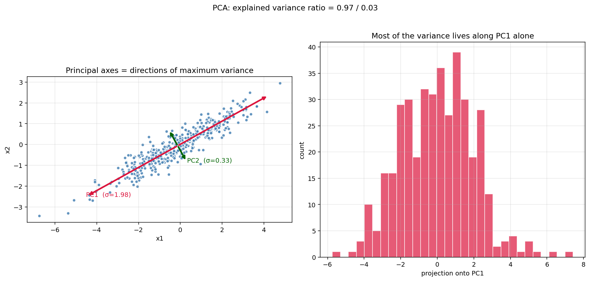
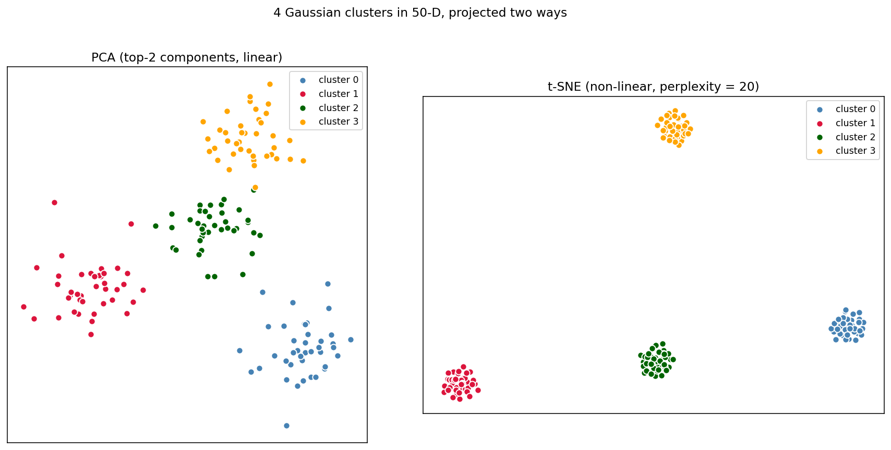
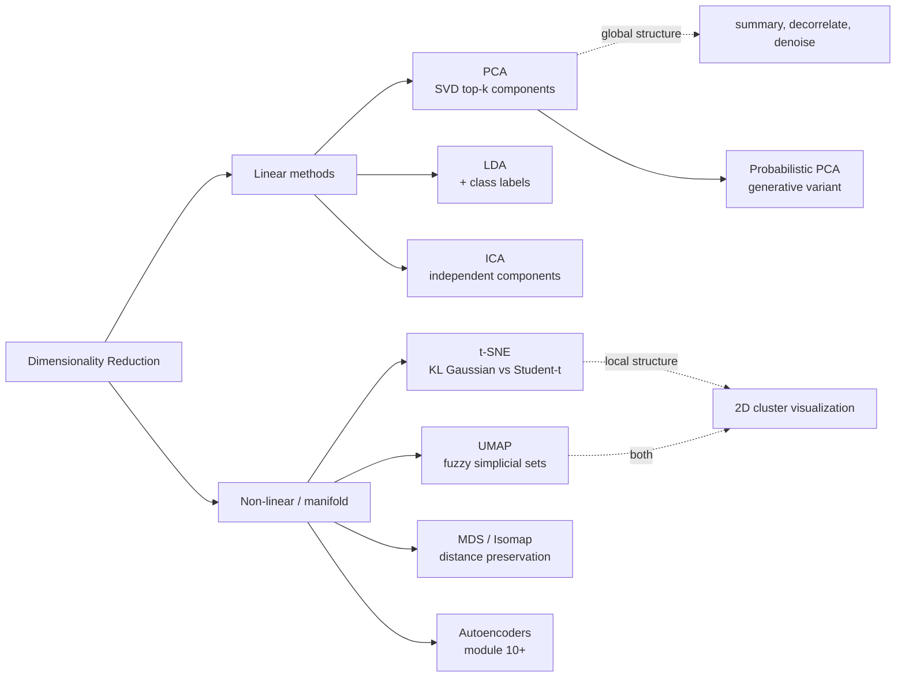

# 09 — Dimensionality Reduction (PCA, t-SNE, UMAP)

> Goal: derive PCA *two ways* (max variance and min reconstruction error) and watch them land at the same SVD answer. Then understand t-SNE / UMAP as preserving *local* structure where PCA preserves *global* variance.

---

## 1. Intuition

- **PCA**: rotate the coordinate system so the new axes point along the *directions of greatest spread*. Then drop the low-variance directions. Linear, deterministic, fast, globally faithful.
- **t-SNE / UMAP**: place points in 2D such that *neighbours stay neighbours*. Distortion of large distances is fine — only the local neighbourhood graph matters. Non-linear, stochastic, slower, locally faithful.

If you want a faithful low-dim *summary* of variance: PCA. If you want a 2D *picture* of clusters: t-SNE or UMAP. They answer different questions.

---

## 2. The math

### 2.1 PCA derived two ways

Let `X ∈ ℝⁿˣᵈ` be data, centered (`Σᵢ xᵢ = 0`). The empirical covariance matrix is `C = (1/n) Xᵀ X`.

#### Derivation 1: maximize variance

We want a unit vector `v ∈ ℝᵈ` such that the projected variance is maximized:

```
maximize    Var(X v) = vᵀ C v
subject to  ‖v‖ = 1
```

Lagrangian: `L(v, λ) = vᵀ C v - λ (vᵀ v - 1)`. Derivative:

```
∂L/∂v = 2 C v - 2 λ v = 0     ⇒   C v = λ v
```

So `v` is an *eigenvector* of `C`, and the projected variance `vᵀ C v = λ` is its eigenvalue. **The optimal direction is the eigenvector with the largest eigenvalue.**

The second-best direction is the next eigenvector (orthogonal to the first by symmetry of `C`), and so on. The top-`k` eigenvectors of `C` form the **principal components**.

#### Derivation 2: minimize reconstruction error

Find a rank-`k` projection `P_k = V_k V_kᵀ` (where `V_k ∈ ℝᵈˣᵏ` has orthonormal columns) that minimizes:

```
‖X - X P_k‖_F²
```

Expand:

```
‖X - X V_k V_kᵀ‖² = tr(Xᵀ X) - 2 tr(V_kᵀ Xᵀ X V_k) + tr(V_kᵀ Xᵀ X V_k)
                  = tr(Xᵀ X) - tr(V_kᵀ Xᵀ X V_k)
```

Minimizing this = maximizing `tr(V_kᵀ Xᵀ X V_k)`, which (by the trace-eigenvector inequality / Ky Fan's theorem) is maximized when the columns of `V_k` are the top-`k` eigenvectors of `Xᵀ X`. **Same answer as Derivation 1.**

#### The SVD route (the cleanest implementation)

Singular value decomposition:

```
X = U Σ Vᵀ
```

with `U ∈ ℝⁿˣⁿ`, `Σ ∈ ℝⁿˣᵈ` diagonal, `V ∈ ℝᵈˣᵈ` orthogonal. Then:

```
Xᵀ X = V Σᵀ Σ Vᵀ
```

The columns of `V` are eigenvectors of `Xᵀ X` and the squared singular values `σᵢ²` are the eigenvalues. **The top-`k` columns of `V` are the principal components.** One `np.linalg.svd(X, full_matrices=False)` call and you have PCA.

**Reduced representation**: `X_k = X V[:, :k] = U[:, :k] Σ[:k, :k]`.

**Explained variance ratio** of component `j`: `σⱼ² / Σᵢ σᵢ²`.

### 2.2 Standardize before PCA

PCA is computing variance — features on different scales will dominate or vanish artificially. Always standardize (subtract mean, divide by std) before PCA unless every feature is already on the same scale.

### 2.3 t-SNE in one screen

Define similarity in *input* space using a Gaussian kernel per row:

```
p_{j|i} = exp(-‖xᵢ - xⱼ‖² / 2σᵢ²) / Σ_{k≠i} exp(-‖xᵢ - xₖ‖² / 2σᵢ²)
p_{ij}  = (p_{j|i} + p_{i|j}) / (2n)      (symmetrize)
```

The bandwidth `σᵢ` is chosen so each row has a target *perplexity* (effective neighbour count). The Gaussian falls off fast — long-range pairs get ~0 weight.

Define similarity in *output* (2D) space using a **Student t-distribution** with one degree of freedom (heavy-tailed):

```
q_{ij} = (1 + ‖yᵢ - yⱼ‖²)⁻¹ / Σ_{k≠ℓ} (1 + ‖yₖ - yℓ‖²)⁻¹
```

Find `Y` that minimizes the **KL divergence**:

```
KL(P ‖ Q) = Σ_{i≠j} p_{ij} log( p_{ij} / q_{ij} )
```

via gradient descent (with momentum, early exaggeration, and learning-rate tricks). The KL is asymmetric — it punishes putting nearby input points *far* apart much more than putting far input points *near*. That's what makes t-SNE preserve local structure.

**The Student-t in output space** is the secret sauce. It has heavier tails than a Gaussian, so when far-apart points end up nearby in 2D they pay little penalty — this leaves room for tightly-packed local clusters without forcing them to fill the whole map.

**Crucial caveat**: **t-SNE distances are not meaningful.** Two well-separated clusters in 2D may be much closer in input space than they appear. Only the *neighbourhood structure* is preserved.

### 2.4 UMAP in one paragraph

UMAP (McInnes et al., 2018) optimizes a similar local-vs-global objective using **fuzzy simplicial sets** instead of Gaussian/Student-t affinities. In practice: faster than t-SNE, better at preserving large-scale structure, similarly excellent at visualizing local clusters. Same warning about distances.

---

## 3. Diagrams

| Script | Shows |
|---|---|
| `diagram_pca_geometry.py` | 2D correlated Gaussian; the two principal axes drawn over the data; how a 1D projection onto PC1 looks |
| `diagram_pca_vs_tsne.py` | 4 well-separated 50-D Gaussian clusters; PCA's 2D projection vs a from-scratch t-SNE — same clusters, very different layouts |

Regenerate:
```powershell
python diagram_pca_geometry.py
python diagram_pca_vs_tsne.py
```





---

## 4. Mind-map: dimensionality reduction family



---

## 5. From scratch

`from_scratch.py` implements:

- `PCA` — one-line SVD, plus explained-variance ratios and a `transform` method.
- `tSNE` — minimal but real: Gaussian P with binary-search perplexity tuning, Student-t Q, gradient descent with momentum and early exaggeration. ~100 lines.

The script:
1. PCA on a 2D correlated Gaussian — shows the eigenvalues and the explained variance ratio.
2. PCA + t-SNE on 4 well-separated 50-D Gaussian clusters. Both recover the cluster structure. PCA keeps clusters' *relative positions* roughly faithful; t-SNE forms tight isolated balls.

Run:
```powershell
python from_scratch.py
```

---

## 6. When to use / when it breaks

**PCA:**
- Use when: you want a fast linear summary, decorrelation, or denoising; before a downstream model that suffers in high d (kNN, k-means).
- Breaks when: the structure is non-linear (a Swiss roll, a torus, ring clusters) — PCA can't unroll it.

**t-SNE:**
- Use when: you want a *picture* of cluster structure in 2D.
- Breaks when: you need *distances* to be meaningful, you need deterministic output (it's stochastic), you have very large datasets (slow without Barnes-Hut).

**UMAP:**
- Use when: same goal as t-SNE but faster on large data and with somewhat-meaningful global distances.
- Breaks when: you need to embed *new* points (UMAP supports this better than t-SNE, but still imperfect); you need a probabilistic interpretation.

---

## 7. References

- Pearson — *On Lines and Planes of Closest Fit to Systems of Points in Space* (1901). The original PCA paper.
- ESL §14.5 (PCA derivation), §14.8 (non-linear DR).
- van der Maaten & Hinton — *Visualizing Data using t-SNE* (2008). The t-SNE paper. Short, readable.
- McInnes, Healy, Melville — *UMAP* (2018).
- Wattenberg, Viégas, Johnson — *How to Use t-SNE Effectively* (2016, Distill.pub). Required reading before you trust any t-SNE plot you didn't make yourself.
