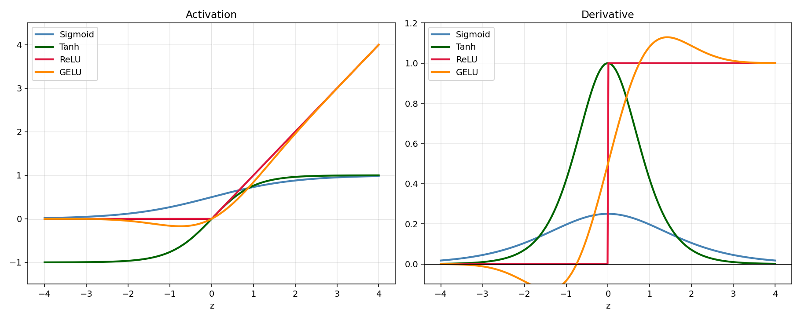
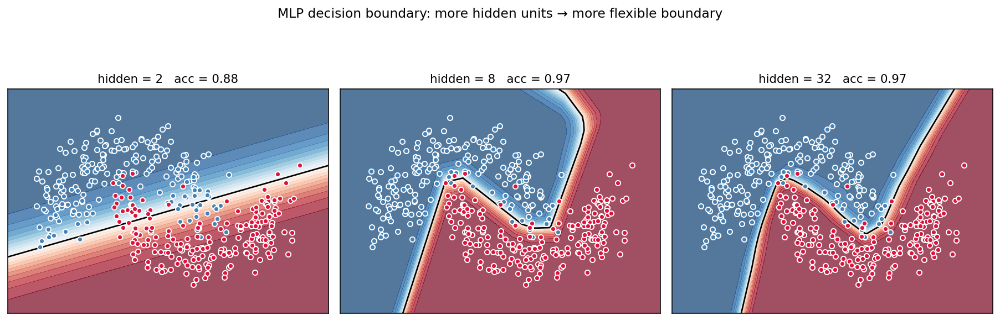
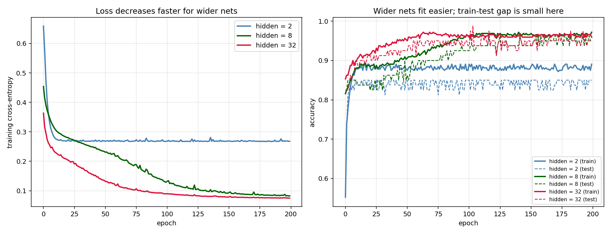
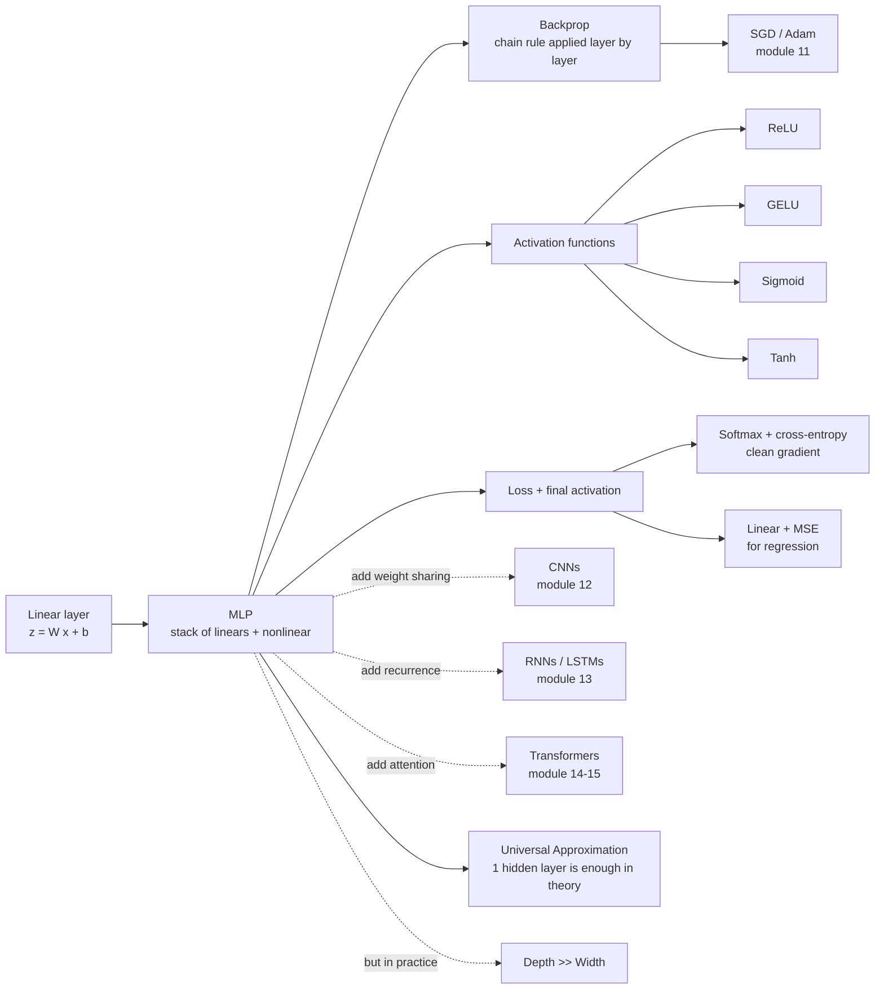

# 10 — Neural Nets: MLP & Backpropagation

> Goal: derive backpropagation by hand on a 2-layer net using *only* the chain rule. Implement it in NumPy with no autodiff. Never be afraid of `loss.backward()` again.

This is the module where the math from 00 (chain rule) earns its keep. Get backprop right once and the deep-learning modules (11–15) become much easier.

---

## 1. Intuition

A multi-layer perceptron is the most parameterized way to stack linear models: `Linear → activation → Linear → activation → …`. The non-linearity is the whole point — without it, any composition of linear layers collapses to a single linear layer.

Training is the same `argmin L(θ)` you've seen since module 01 — but the parameter vector `θ` is enormous and the gradient has to be computed *through* every layer. Backprop is the algorithm that does that gradient computation in `O(parameters)` time. It's just the chain rule applied repeatedly, written down carefully.

---

## 2. The math, derived

### 2.1 Forward pass (a 2-layer net, shapes annotated)

Inputs `X ∈ ℝⁿˣᵈ` (batch of `n` samples, each `d`-dimensional). One hidden layer of width `h`, output of `K` classes.

```
Layer 1  :   Z1 = X W1 + b1      shape:  (n, h),   W1 ∈ ℝᵈˣʰ, b1 ∈ ℝʰ
Activation:  A1 = ReLU(Z1)        shape:  (n, h)
Layer 2  :   Z2 = A1 W2 + b2      shape:  (n, K),  W2 ∈ ℝʰˣᴷ, b2 ∈ ℝᴷ
Softmax  :   Y_hat = softmax(Z2)  shape:  (n, K)
Loss     :   L = (1/n) Σᵢ -log Y_hat[i, yᵢ]   (cross-entropy)
```

Softmax row-wise:

```
softmax(z)_k = exp(z_k) / Σⱼ exp(z_j)
```

(Numerical trick: subtract the row max before exponentiating to prevent overflow.)

### 2.2 Backprop — chain rule layer by layer

The clever ordering: compute the gradient of the loss w.r.t. each layer's *pre-activation* `Zℓ` (call this **delta** `δℓ`), then derive `dW`, `db`, and the *next* delta from it.

**Step A — softmax + cross-entropy give a beautiful gradient:**

For a single sample, with one-hot target `y` and prediction `ŷ = softmax(Z2)`:

```
∂L/∂z2_k = ŷ_k - y_k       (derivation in any textbook; "predicted minus target")
```

Stacking samples: `dL/dZ2 = (Y_hat - Y_onehot) / n`. **Two things cancelled — softmax's derivative with cross-entropy's `1/ŷ` — to give this clean residual form.** Without that cancellation, this gradient would be ugly. It's the same `Xᵀ(σ - y)` pattern from logistic regression (module 02). The pattern stays clean as long as you pair the right loss with the right output activation.

So: `δ2 := dL/dZ2 = (Ŷ - Y_onehot) / n`,  shape `(n, K)`.

**Step B — gradients for the output layer:**

`Z2 = A1 W2 + b2`. Apply the chain rule:

```
dL/dW2 = A1ᵀ δ2          shape: (h, K)
dL/db2 = Σ_i δ2[i, :]    shape: (K,)
```

(`(h, n) · (n, K) → (h, K)`. Checks dimensions.)

**Step C — propagate the gradient back into the hidden layer:**

To get `dL/dA1`, chain through `Z2 = A1 W2 + b2`:

```
dL/dA1 = δ2 W2ᵀ          shape: (n, h)
```

Then through the ReLU. ReLU's derivative is `1` where `Z1 > 0`, else `0`:

```
δ1 := dL/dZ1 = dL/dA1 ⊙ 1[Z1 > 0]          shape: (n, h)
```

**Step D — gradients for the input layer:**

`Z1 = X W1 + b1`:

```
dL/dW1 = Xᵀ δ1           shape: (d, h)
dL/db1 = Σ_i δ1[i, :]    shape: (h,)
```

That's the full backward pass. Every layer follows the same three lines:

1. `δℓ` from the next layer (via `Wℓ₊₁ᵀ` and the activation derivative).
2. `dWℓ = (input to layer ℓ)ᵀ · δℓ`.
3. `dbℓ = Σ_i δℓ[i, :]`.

Stack `L` layers, repeat. That's backprop.

**SGD update**:

```
W ← W - η · dW
b ← b - η · db
```

### 2.3 Activation functions

| Activation | Formula | Derivative | Notes |
|---|---|---|---|
| Sigmoid | `1 / (1 + e⁻ᶻ)` | `σ(z)(1 - σ(z))` | Saturates at the tails → vanishing gradients in deep nets |
| Tanh | `(eᶻ - e⁻ᶻ)/(eᶻ + e⁻ᶻ)` | `1 - tanh²(z)` | Zero-centered version of sigmoid; same vanishing issue |
| ReLU | `max(0, z)` | `1[z > 0]` | Default choice. Cheap, no vanishing for `z > 0`. Can "die" for `z < 0`. |
| Leaky ReLU | `max(0.01z, z)` | `0.01` or `1` | Fixes dead neurons |
| GELU | `z · Φ(z)` | smooth approx | Modern default in Transformers (module 15) |

ReLU is the right default for most networks until you hit a Transformer.

### 2.4 Universal approximation, in one paragraph

A 1-hidden-layer MLP with enough neurons can approximate any continuous function on a compact set to any desired accuracy (Cybenko, 1989; Hornik, 1991). In practice, **depth** matters more than the *theorem's* width — deep narrow networks express many functions exponentially more efficiently than wide shallow ones. That's why we stack.

### 2.5 Initialization (one line)

Initialize weights with **Xavier / He** scaling: `W ~ N(0, 2 / fan_in)` for ReLU. Otherwise variance explodes or shrinks layer by layer and training stalls. Bias is usually zero. The full theory waits in module 11.

---

## 3. Diagrams

| Script | Shows |
|---|---|
| `diagram_activations.py` | Sigmoid / tanh / ReLU / GELU side by side, with derivatives |
| `diagram_decision_boundary.py` | MLP decision boundary on two-moons at hidden widths 2, 8, 32 — capacity increases with width |
| `diagram_training_curves.py` | Cross-entropy loss and accuracy across training, comparing widths |

Regenerate:
```powershell
python diagram_activations.py
python diagram_decision_boundary.py
python diagram_training_curves.py
```







---

## 4. Mind-map: neural net family



---

## 5. From scratch

`from_scratch.py` implements:

- `MLPClassifier` — 1-hidden-layer net with ReLU and softmax + cross-entropy.
- Hand-coded forward and backward passes (no autodiff anywhere).
- Mini-batch SGD with a learning-rate schedule.
- A **numerical gradient check** that perturbs each parameter by `ε`, compares finite-difference and analytical gradients, prints the max relative error — your safety net that backprop was implemented correctly.

The script:
1. Trains on two-moons with hidden widths `{2, 8, 32}`.
2. Runs the gradient check on a tiny instance — prints `OK` if backprop matches finite differences within `1e-5`.
3. Reports final train/test accuracy at each width.

Run:
```powershell
python from_scratch.py
```

The gradient check is the single most useful debugging trick in this entire course — learn it now and use it every time you implement a new layer.

---

## 6. When to use / when it breaks

**Use when:**
- You have enough data (`n > ~10⁴`) for the model not to memorize.
- Features benefit from non-linear combinations.
- You want a flexible function approximator.

**Breaks when:**
- Small data → severe overfitting. (Regularize, dropout, augment, or just use a smaller model — module 11.)
- Bad initialization → gradients vanish or explode.
- No GPU → training takes forever past tiny scales.
- The data has special structure (spatial → CNN, sequential → RNN/Transformer) — a vanilla MLP is wasteful.

---

## 7. References

- Rumelhart, Hinton, Williams — *Learning representations by back-propagating errors* (1986). The original.
- Nielsen — *Neural Networks and Deep Learning* (free book), Chapter 2. The best gentle backprop walk-through anywhere.
- Karpathy — *Yes you should understand backprop* (Medium, 2016) and *Hacker's guide to Neural Networks* (the legendary post). Required reading.
- Goodfellow, Bengio, Courville — *Deep Learning*, §6. Foundational.
- 3Blue1Brown — *But what is a neural network?* (YouTube playlist). Watch episodes 1–4 alongside this module.
