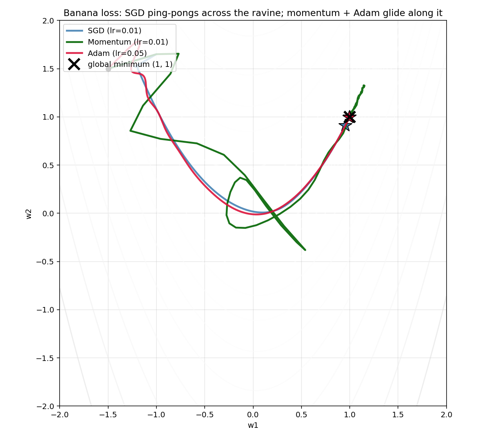
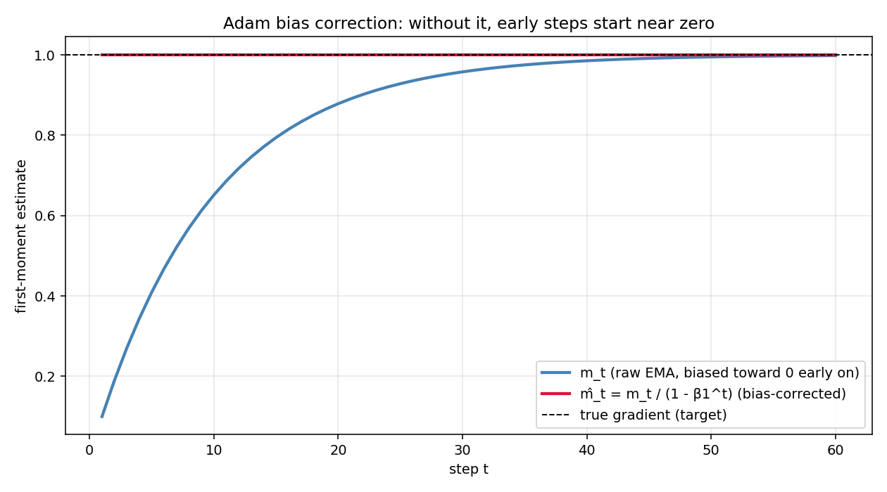
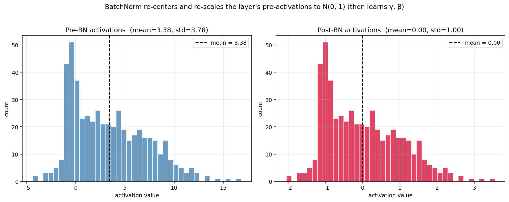
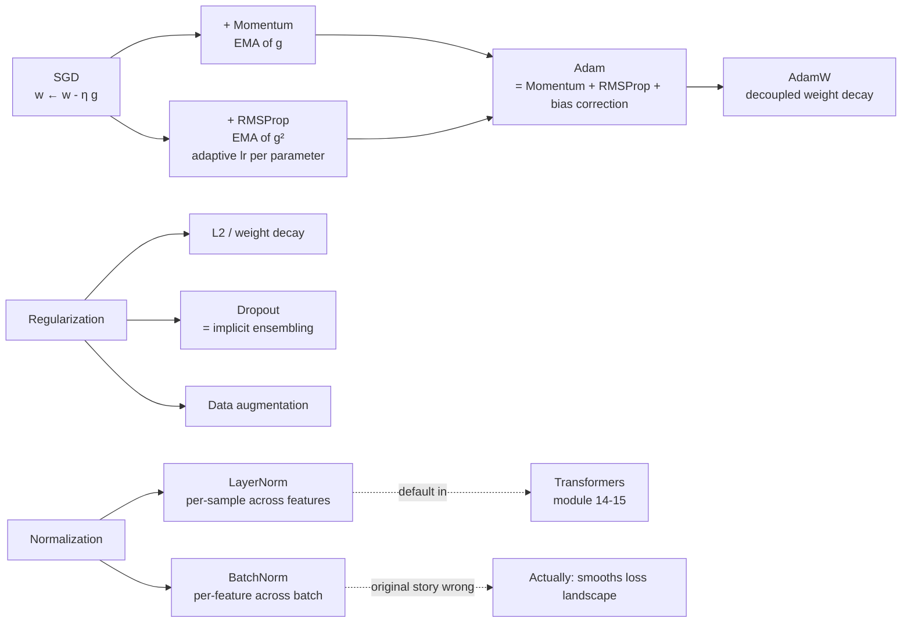

# 11 — Training Deep Nets (Optimizers, Dropout, BatchNorm)

> Goal: see the optimizer family (SGD → Momentum → RMSProp → Adam) as one shared update rule with two knobs added at a time. Understand Dropout and BatchNorm as principled regularizers, not hacks. Know when AdamW differs from Adam + L2 (it does).

---

## 1. Intuition

Modern training looks like a stack of small tricks: adaptive learning rates, momentum, noise injection, normalization. Each one fixes a specific failure mode of vanilla SGD on deep models. This module is the glossary: what each trick does, why it works, when it fails.

The good news: every optimizer in this module is one short formula.

---

## 2. The math

### 2.1 The optimizer family (one update rule, two extras)

Vanilla **SGD** on parameter `w` with stochastic gradient `g_t = ∇L(w_t, mini-batch)`:

```
w_{t+1} = w_t - η · g_t
```

That's it — and that's also the problem on most real loss surfaces. Three improvements:

#### Momentum (smooth the gradient)

Replace `g_t` with an exponential moving average:

```
v_t = β v_{t-1} + g_t                (typical β = 0.9)
w_{t+1} = w_t - η · v_t
```

Why it works: noisy SGD gradients have a high-variance component. Their EMA cancels out, leaving the "true" descent direction. Geometrically, in a ravine (steep across, shallow along), SGD ping-pongs across; momentum builds up speed *along* the ravine and damps the oscillation.

#### RMSProp (adapt the step size per parameter)

Keep a running average of *squared* gradients:

```
s_t = β s_{t-1} + (1 - β) g_t²        (element-wise square)
w_{t+1} = w_t - η · g_t / (√s_t + ε)
```

Parameters with consistently large gradients get a smaller effective step. Parameters with tiny gradients get a *bigger* one. The result: training is much less sensitive to the global learning rate.

#### Adam = Momentum + RMSProp + bias correction

```
m_t = β₁ m_{t-1} + (1 - β₁) g_t          (1st-moment EMA, momentum)
v_t = β₂ v_{t-1} + (1 - β₂) g_t²         (2nd-moment EMA, RMSProp-style)

m̂_t = m_t / (1 - β₁ᵗ)                   (bias correction)
v̂_t = v_t / (1 - β₂ᵗ)

w_{t+1} = w_t - η · m̂_t / (√v̂_t + ε)
```

Typical defaults: `β₁ = 0.9, β₂ = 0.999, ε = 1e-8, η = 1e-3`.

**Why bias correction**: `m_0 = v_0 = 0`. Without correction, the first few `m_t, v_t` are biased toward zero. Dividing by `1 - βᵗ` ramps up the effective EMA in early steps.

### 2.2 Weight decay ≠ L2 in Adam (the AdamW story)

Naïve L2 regularization adds `(λ/2)‖w‖²` to the loss. The gradient becomes `g + λw`, and you plug that into your optimizer.

For SGD: `w ← w - η(g + λw) = (1 - ηλ) w - η g`. This is exactly the same as **weight decay** applied directly to `w`. The two formulations are identical for SGD.

For Adam: the L2 term `λw` gets divided by `√v̂_t` along with everything else. **Parameters with large `v̂_t` get effectively less weight decay.** That's not what you want — large-gradient parameters were probably the ones you most wanted to shrink.

**Fix: decoupled weight decay (AdamW)**. Apply weight decay directly to `w` *after* the Adam step:

```
w_{t+1} = w_t - η · m̂_t / (√v̂_t + ε) - η · λ · w_t
```

This is what every modern deep-learning recipe uses. Loshchilov & Hutter (2017) showed AdamW often closes the generalization gap between SGD and Adam.

### 2.3 Dropout

At training time, multiply each activation by a Bernoulli(`1 - p`) mask, then scale by `1/(1-p)` (inverted dropout):

```
mask ~ Bernoulli(1 - p)             # per neuron, per forward pass
a_dropped = a · mask / (1 - p)
```

At test time, no dropout — full activations.

Two equivalent justifications:

1. **Implicit ensembling**: at each step, you're training a randomly-sampled subnetwork. The final network is an exponentially-large ensemble averaged together.
2. **Noise injection**: forces the network to not rely on any single neuron, spreading the representation.

Typical `p = 0.5` in fully connected layers, `0.1–0.3` in transformers, often none in convolutional layers.

### 2.4 Batch Normalization

For each *feature* across a mini-batch:

```
μ_B = mean(x_B)
σ²_B = var(x_B)
x̂ = (x - μ_B) / √(σ²_B + ε)        # normalize
y = γ · x̂ + β                      # learnable scale and shift
```

`γ` and `β` are *per-feature* trainable parameters. At inference, use running averages of `μ_B, σ²_B` collected during training.

**Why BN helps**: the original paper (Ioffe & Szegedy, 2015) attributed it to reducing "internal covariate shift". That story turned out to be wrong — Santurkar et al. (2018) showed empirically that BN simply *smooths the loss landscape*, making larger learning rates safe. Use it; don't bother defending the original justification.

**When BN breaks:**
- Tiny batch sizes (`< 8`) → noisy batch statistics → unstable.
- Sequence models / variable-length inputs (use **LayerNorm**, used in transformers, module 15).

### 2.5 LayerNorm (one line, used everywhere in transformers)

Normalize across *features* per sample (not across the batch):

```
μ = mean of x[i] over features
σ² = var of x[i] over features
x̂[i] = (x[i] - μ) / √(σ² + ε)
y[i] = γ · x̂[i] + β
```

Batch-size-independent. Works for any input shape. Default in modern architectures.

---

## 3. Diagrams

| Script | Shows |
|---|---|
| `diagram_optimizer_paths.py` | SGD, momentum, RMSProp, Adam trajectories on a 2D banana loss (Rosenbrock-ish). Adam reaches the minimum first; SGD oscillates |
| `diagram_bias_correction.py` | Adam's first-moment estimate with vs without bias correction. Without correction, early steps are clipped toward zero |
| `diagram_bn_distributions.py` | Histogram of pre-activations before and after a BatchNorm layer, across multiple training steps |

Regenerate:
```powershell
python diagram_optimizer_paths.py
python diagram_bias_correction.py
python diagram_bn_distributions.py
```







---

## 4. Mind-map: training-time machinery



---

## 5. From scratch

`from_scratch.py` implements:

- `SGD`, `Momentum`, `Adam` optimizers — each as a tiny class with a `step(params, grads)` method.
- `Dropout` and `BatchNorm` layers with forward and backward passes.
- A small **deep MLP** (3 hidden layers) on a noisy 3-class problem.
- A 2D-banana optimizer comparison: run all four optimizers from the same starting point on a quadratic-with-ravine loss and plot the trajectories.

The script:
1. Compares SGD vs Momentum vs Adam on the deep MLP — Adam usually converges fastest.
2. Trains the same network with and without Dropout (`p = 0.5`) and BatchNorm — measures the gap closed on a noisy test set.

Run:
```powershell
python from_scratch.py
```

---

## 6. When to use / when it breaks

**SGD + momentum**: still the right default for very large vision models (ResNets, ConvNeXt) where the best generalization comes from the *flat* minima SGD finds.

**Adam / AdamW**: defaults for everything else. Transformers, RNNs, smaller convs, RL. Use AdamW (not Adam + L2) when you want weight decay.

**Dropout**: most useful in fully-connected layers and in transformers (`p = 0.1–0.3`). Often *not* applied to conv layers (use BN/aug instead). Test-time scaling matters — get inverted dropout right or your predictions will be off.

**BatchNorm**: needs reasonable batch size (`≥ 16`). Breaks for tiny batches; if you must use them, switch to GroupNorm or LayerNorm.

**LayerNorm**: default in transformers. Use when batch size is variable or tiny.

---

## 7. References

- Kingma & Ba — *Adam: A Method for Stochastic Optimization* (2014).
- Loshchilov & Hutter — *Decoupled Weight Decay Regularization* (2017). The AdamW paper.
- Srivastava et al. — *Dropout* (2014). The original.
- Ioffe & Szegedy — *Batch Normalization* (2015). The original.
- Santurkar, Tsipras, Ilyas, Madry — *How Does Batch Normalization Help Optimization?* (2018). The "covariate shift" debunk.
- Ba, Kiros, Hinton — *Layer Normalization* (2016).
- Wilson et al. — *The Marginal Value of Adaptive Gradient Methods in Machine Learning* (2017). Argues SGD generalizes better than Adam in some regimes.
