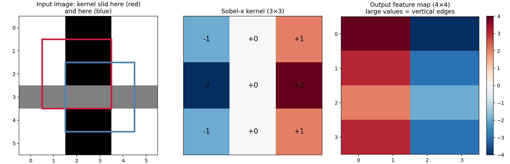
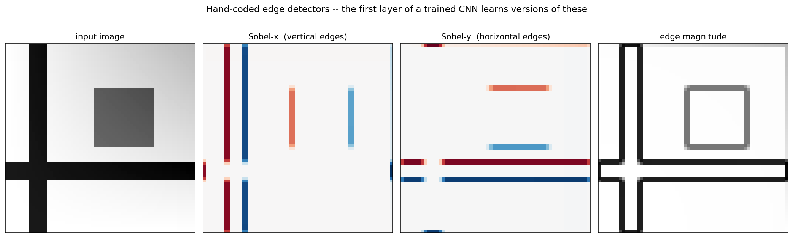
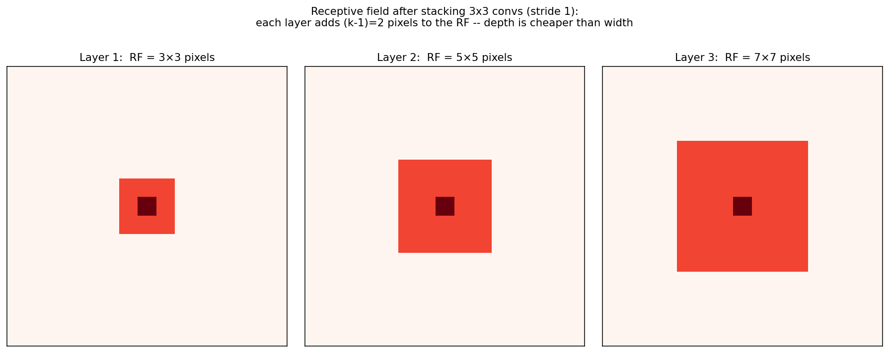
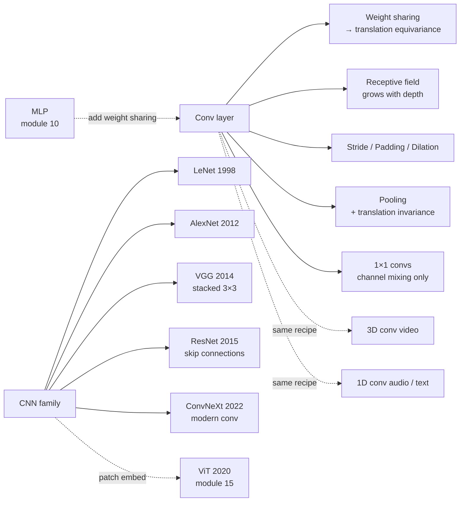

# 12 — Convolutional Neural Networks

> Goal: see convolution as a *constrained* linear layer with **weight sharing** and **local receptive fields**. Understand why those two constraints make vision tractable — and why "translation equivariance" is the inductive bias that lets a CNN train on a hundredth the data an MLP needs for the same task.

---

## 1. Intuition

A fully-connected layer assumes every input pixel can interact with every output neuron. For a 224×224 image that's ~50 000 inputs per neuron — and you'd need a separate neuron for every output position. Madness.

A convolutional layer says: the same small set of weights, applied to every patch of the image. *That's* the difference. Translate the input by one pixel, the output translates by one pixel too — **translation equivariance**, baked in as an architectural constraint.

---

## 2. The math

### 2.1 2D convolution (really cross-correlation)

Given an input image `X ∈ ℝ^{H × W}` and a kernel `K ∈ ℝ^{k × k}`, the output feature map is:

```
Y[i, j] = Σ_{u=0..k-1} Σ_{v=0..k-1}  K[u, v] · X[i + u, j + v]
```

Output size: `(H - k + 1) × (W - k + 1)`. (Strictly, deep learning calls this "convolution" but it's mathematically cross-correlation — the kernel is *not* flipped. Doesn't matter; the kernel is learned either way.)

**With stride `s`**: shift the kernel by `s` each step. Output size: `⌊(H - k) / s⌋ + 1`.

**With padding `p`**: pad the input with `p` zeros on each side. Output size: `(H + 2p - k) / s + 1`. Set `p = (k-1)/2` and `s = 1` for "same" padding (output same size as input).

**With dilation `d`**: skip `d-1` positions between kernel entries. Useful for enlarging the receptive field without adding parameters.

### 2.2 Channels: input channels and output channels

Real images have channels (RGB → 3). One convolution layer:

```
Input  : (C_in, H, W)
Kernel : (C_out, C_in, k, k)    ← one (C_in × k × k) filter per output channel
Output : (C_out, H', W')

Y[c, i, j] = Σ_{c'} Σ_{u,v}  K[c, c', u, v] · X[c', i+u, j+v]   +   b[c]
```

Each of the `C_out` filters slides across all `C_in` input channels and sums. Parameter count: `C_out · C_in · k² + C_out`. **Independent of image size** — that's the win over a fully-connected layer.

### 2.3 Weight sharing → translation equivariance

The same kernel applies at every spatial position. Shift the input by `(Δi, Δj)`, and the output shifts by the same amount. This is the architectural prior that an MLP lacks. Without weight sharing, an MLP has to *re-learn* every visual feature at every location.

Equivariance ≠ invariance. CNNs are equivariant by construction; pooling adds *invariance* to small shifts.

### 2.4 Pooling

Max-pool over a `k × k` window with stride `k`:

```
Y[i, j] = max over (u, v) in window  of  X[i·k + u, j·k + v]
```

Average pool does the same with `mean`. Effects: downsample (often by 2×), add local translation invariance, throw away ~3/4 of the information. Modern networks (ResNet, ConvNeXt) often skip explicit pooling in favor of strided convolutions, which are learnable.

### 2.5 Receptive field

The set of input pixels a given output neuron depends on. For a stack of conv layers with kernel sizes `k_1, k_2, ...` and strides `s_1, s_2, ...`:

```
RF_L = 1 + Σ_{l=1..L}  (k_l - 1) · ∏_{j<l} s_j
```

Two stacked 3×3 convs with stride 1 have an RF of 5×5 — same as one 5×5 conv but with fewer parameters (`2 · 9 = 18` vs `25`) and an extra non-linearity. This is the VGG insight that made small kernels universal.

**Practical implication**: the network's RF must grow at least as large as the structures you're trying to recognize. ResNet-50 has an RF of about 480×480 — enough to "see" most of a 224×224 image multiple times over.

### 2.6 1×1 convolutions

A 1×1 kernel doesn't combine spatial neighbours — it's just a per-pixel linear projection across channels. Sounds useless, isn't. Uses:

- **Bottleneck**: shrink channel count before an expensive 3×3 conv (ResNet, MobileNet).
- **Channel mixing without spatial mixing** — a building block in modern architectures.

### 2.7 Modern blocks (in one paragraph each)

- **ResNet residual block**: `output = x + F(x)`, where `F` is two or three conv layers. The skip connection lets gradients flow straight back through 100+ layers (He et al., 2015).
- **Inverted bottleneck (MobileNet, ConvNeXt)**: 1×1 expand → 3×3 depthwise conv → 1×1 project. Far fewer parameters than vanilla conv for similar accuracy.
- **ViT patch embedding** = a strided convolution: a `16 × 16` conv with stride 16 over the image is exactly the patch embedding in a Vision Transformer (Dosovitskiy et al., 2020). Convolution is the *first* layer of every ViT, whether the paper admits it or not.

### 2.8 Backprop through conv

Same chain rule as the MLP. Three gradients per conv layer:

- `dL/dK` (filter) is itself a convolution: input ⊛ output-gradient.
- `dL/db` is the sum of the output-gradient across spatial positions.
- `dL/dX` (input) is a *transposed* convolution of the output gradient with the (flipped) kernel.

The `im2col` trick reshapes each input patch into a column so conv becomes a matrix multiply (`Y = K_mat · X_im2col`), and backprop becomes the matrix transpose. That's what every modern CNN framework actually computes.

---

## 3. Diagrams

| Script | Shows |
|---|---|
| `diagram_convolution.py` | A 6×6 image and a 3×3 Sobel-x kernel; the kernel highlighted at two positions and the resulting feature map |
| `diagram_filters.py` | Same synthetic image processed with Sobel-x, Sobel-y, and an edge-magnitude filter — first-layer CNN filters typically learn versions of these |
| `diagram_receptive_field.py` | Receptive field growth with depth: input pixels reachable by output neurons at layers 1, 2, 3 of a stack of 3×3 convs |

Regenerate:
```powershell
python diagram_convolution.py
python diagram_filters.py
python diagram_receptive_field.py
```







---

## 4. Mind-map: CNN family



The mental model: **CNN = MLP + (weight sharing + local receptive fields)**. Those two constraints encode the prior that "patterns in images repeat across positions, and meaning is built up from local features." That prior is so right for vision that throwing it away costs you 10× the data and never quite catches up.

---

## 5. From scratch

`from_scratch.py` implements:

- `conv2d_naive` — explicit-loop 2D convolution with optional stride and padding.
- A `Conv2D` layer class with forward pass (backward is sketched; full backward is in the README's section 2.8).
- A demonstration: apply Sobel-x and Sobel-y filters to a synthetic image and check the result against `scipy.signal.correlate2d` (used only as a verifier, not in the core loop).

The script:
1. Builds a 16×16 synthetic "image" of vertical bars.
2. Convolves it with Sobel-x — only the vertical edges light up.
3. Computes edge magnitude `√(S_x² + S_y²)` — extracts edges in any direction.
4. Verifies against scipy to within `1e-10`.

This module is shorter on code than 10 or 11 because the *math of conv backprop* is structurally identical to MLP backprop (same chain-rule game with a `Conv` op instead of a `Linear` op). End-to-end CNN training on real images is **Lab C** — there we use PyTorch because hand-coded conv backprop on real-size images is glacial.

Run:
```powershell
python from_scratch.py
```

---

## 6. When to use / when it breaks

**Use when:**
- Inputs have spatial structure where translation matters: images, audio spectrograms, time series.
- You have moderate data — the inductive bias means CNNs train on far less than MLPs need.

**Breaks when:**
- Inputs are unordered (sets, graphs). Use GNNs or Set transformers instead.
- Inputs are tabular. CNNs are a bad fit; gradient boosting (module 06) usually wins.
- At extreme scale + data, Vision Transformers (module 15) match or beat CNNs. The inductive bias of conv stops mattering when you have enough data to learn it from scratch.

---

## 7. References

- LeCun et al. — *Gradient-Based Learning Applied to Document Recognition* (LeNet, 1998).
- Krizhevsky et al. — *AlexNet* (2012). The paper that started deep learning.
- Simonyan & Zisserman — *Very Deep CNNs* (VGG, 2014).
- He et al. — *Deep Residual Learning* (ResNet, 2015). One of the most-cited papers in ML.
- Liu et al. — *A ConvNet for the 2020s* (ConvNeXt, 2022).
- Stanford CS231n notes — still the gold-standard pedagogical resource.
