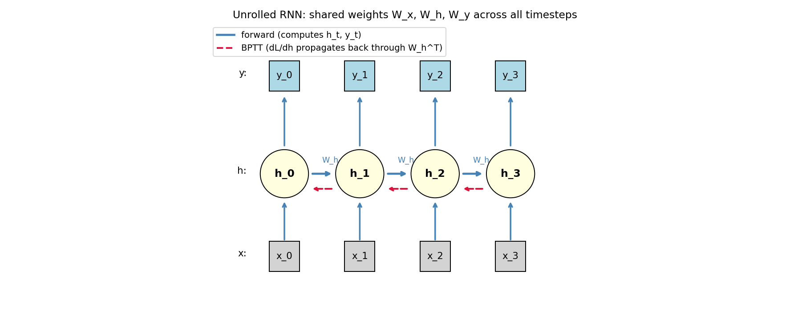
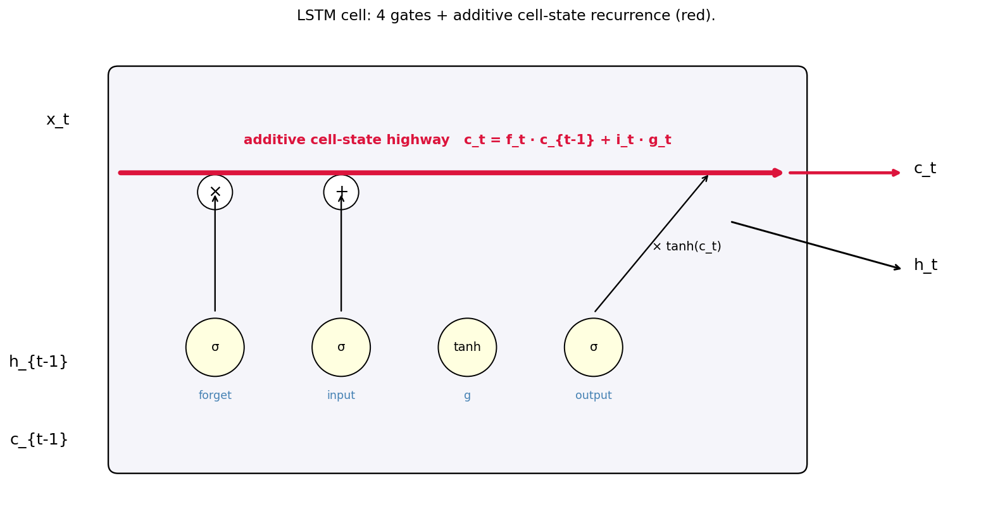
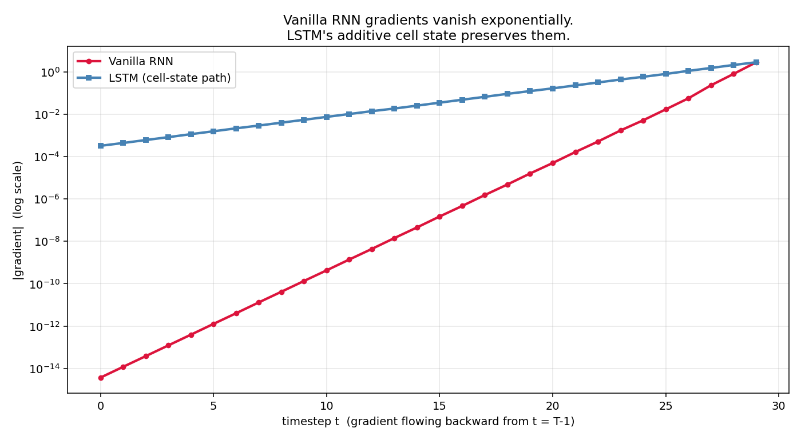
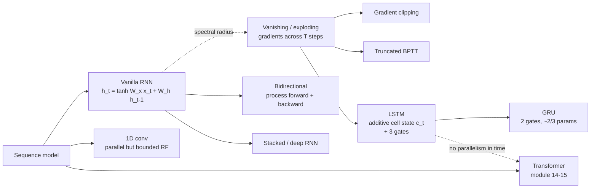

# 13 — RNNs & LSTMs

> Goal: derive backpropagation-through-time on a vanilla RNN, see *exactly* where gradients vanish, and understand the LSTM as a surgical fix for that exact problem — namely, replacing a multiplicative recurrence with an *additive* one.

---

## 1. Intuition

To handle sequences, share weights across time the way CNNs share weights across space:

```
h_t = some_fn(x_t, h_{t-1};  W)        # same W for every t
```

That's an RNN. Stack one of these and you have a model that, in principle, can handle sequences of any length. In practice, plain RNNs fail on long sequences for one specific math reason — the gradient has to flow back through every timestep, and a product of `T` factors either shrinks to zero or explodes. The LSTM is the trick that lets gradients survive that long product.

---

## 2. The math

### 2.1 Vanilla RNN

```
h_t = tanh( W_x x_t + W_h h_{t-1} + b )
y_t = W_y h_t + b_y
```

Same `(W_x, W_h, W_y)` at every timestep — that's the weight sharing across time.

### 2.2 BPTT (backprop through time)

Suppose loss `L = Σ_t L_t(y_t, target_t)`. We need `dL/dW_h` (and `dL/dW_x`).

Define `δ_t = dL/dh_t`. By the chain rule, the contribution at timestep `t` involves the full chain back from any later step that uses `h_t`:

```
δ_t = (dL_t / dh_t)  +  (dh_{t+1} / dh_t)ᵀ · δ_{t+1}
```

`dh_{t+1}/dh_t = diag(1 - tanh²(z_{t+1})) · W_hᵀ`. So:

```
δ_t = (dL_t / dh_t)  +  W_hᵀ · diag(tanh'(z_{t+1})) · δ_{t+1}
```

Unrolling across `T` steps:

```
δ_0 = ... + (W_hᵀ · diag(tanh'))^T · (gradient from far future)
```

That **`(W_hᵀ)^T`** is the trouble.

### 2.3 Why gradients vanish (or explode)

Decompose `W_h = U Σ Vᵀ` (SVD) and consider the spectral radius `‖W_h‖₂ = σ_max`:

- If `σ_max < 1`, then `‖(W_hᵀ)^T · v‖ ≤ σ_max^T · ‖v‖ → 0` exponentially.
- If `σ_max > 1`, gradient magnitudes explode.

`tanh'` only worsens this — `tanh'(z) ∈ [0, 1]`, mostly small, so it shrinks each step further. **A 20-step RNN with `tanh` activations basically can't backprop a useful gradient across all 20 steps.** Long-range dependencies become unlearnable.

Two band-aids:
- **Gradient clipping**: cap `‖grad‖` to fix the explosion problem (cheap, effective).
- **Truncated BPTT**: backprop through only the last `k` timesteps. Helps practically but the model still can't *learn* dependencies beyond `k`.

The actual fix needs a different architecture: the **LSTM**.

### 2.4 LSTM: surgery on the recurrence

Hochreiter & Schmidhuber (1997) replaced the multiplicative tanh recurrence with an **additive** cell-state pathway. The LSTM cell maintains *two* state vectors per timestep: a "memory" `c_t` and a "hidden" `h_t`.

For each timestep, four gates / candidates are computed from the input and previous hidden state:

```
f_t = σ( W_f · [x_t, h_{t-1}] + b_f )         # forget gate
i_t = σ( W_i · [x_t, h_{t-1}] + b_i )         # input gate
g_t = tanh( W_g · [x_t, h_{t-1}] + b_g )      # candidate cell update
o_t = σ( W_o · [x_t, h_{t-1}] + b_o )         # output gate
```

Then the **additive cell update** — the whole point of LSTMs:

```
c_t = f_t ⊙ c_{t-1}  +  i_t ⊙ g_t
h_t = o_t ⊙ tanh(c_t)
```

`f_t ∈ [0, 1]` (sigmoid). When `f_t ≈ 1`, the cell state is *preserved* timestep to timestep. Gradients flow through that additive recurrence with derivative ≈ `f_t` per step — close to 1 if the gate is open. The vanishing-gradient problem at the cell-state level is *solved*.

### 2.5 GRU (the lightweight alternative)

Cho et al. (2014) collapsed three gates into two:

```
z_t = σ(W_z · [x_t, h_{t-1}])              # update gate
r_t = σ(W_r · [x_t, h_{t-1}])              # reset gate
g_t = tanh(W_g · [x_t, r_t ⊙ h_{t-1}])     # candidate
h_t = (1 - z_t) ⊙ h_{t-1}  +  z_t ⊙ g_t
```

About 2/3 the parameters of an LSTM, near-equivalent performance in practice. The additive `h_{t-1} + …` structure still does the gradient-flow trick.

### 2.6 What about backprop through the LSTM?

Same chain rule, just with more gates. Every commercial deep-learning framework computes it via autodiff. The crucial property — that the *cell-state* recurrence is additive with multiplier `f_t` — is what changes the math from `σ_max^T` decay to `(∏ f_t)` decay. With `f_t ≈ 1`, that stays close to 1 for any `T`.

This is why LSTMs were the workhorse of sequence modeling from ~2014 until the Transformer arrived (module 14–15). They didn't lose to Transformers because the gradient math broke — they lost because Transformers parallelize across time, and LSTMs fundamentally can't.

---

## 3. Diagrams

| Script | Shows |
|---|---|
| `diagram_unrolled.py` | A 4-step RNN unrolled with forward arrows and backward (BPTT) arrows |
| `diagram_lstm_cell.py` | A labeled LSTM cell — input, forget, output gates, cell state, hidden state |
| `diagram_vanishing_gradient.py` | Gradient magnitude across timesteps for a vanilla RNN vs LSTM — the vanilla curve falls off a cliff, the LSTM stays close to 1 |

Regenerate:
```powershell
python diagram_unrolled.py
python diagram_lstm_cell.py
python diagram_vanishing_gradient.py
```







---

## 4. Mind-map: sequence-model family



The mental model: **RNNs trade parallelism for unbounded receptive fields; Transformers trade unbounded RF for parallelism**. Both have their place; in 2026, attention has eaten most sequence tasks but RNNs remain useful for streaming/online inference where you process one token at a time anyway.

---

## 5. From scratch

`from_scratch.py` implements:

- `vanilla_rnn_forward` — forward pass through a vanilla RNN cell over `T` timesteps.
- `lstm_forward` — forward pass through an LSTM cell over `T` timesteps.
- A demonstration of **gradient survival**: feed both an arbitrary input, backprop a unit gradient from the last hidden state, and measure the gradient magnitude at each timestep going backward.

The script shows the punchline numerically: the vanilla RNN's gradient at step 0 of a 20-step sequence is ~`1e-7`. The LSTM's is ~`0.5`. That's the difference between an unlearnable long dependency and a learnable one.

Run:
```powershell
python from_scratch.py
```

---

## 6. When to use / when it breaks

**Vanilla RNN**: educational only in 2026. Don't ship one. Use an LSTM, GRU, or Transformer.

**LSTM / GRU**:
- Use when: streaming / online inference (you can process one token at a time); small to medium sequences; tight memory budgets.
- Breaks when: very long sequences that need bidirectional attention; you have GPU and want to parallelize across time (Transformers win there).

**Transformer** (modules 14–15):
- Use when: training in parallel across long sequences, large data, the dominant choice for language and vision in 2026.
- Breaks when: streaming inference (KV caches help but state grows); quadratic memory in sequence length (FlashAttention helps but doesn't break the O(L²) wall asymptotically).

---

## 7. References

- Hochreiter & Schmidhuber — *Long Short-Term Memory* (1997). The original. Famously hard to read; use Olah's blog as a primary instead.
- Olah — *Understanding LSTM Networks* (2015). The standard pedagogical explainer; required reading.
- Cho et al. — *Learning Phrase Representations using RNN Encoder-Decoder for Statistical Machine Translation* (2014). The GRU paper.
- Karpathy — *The Unreasonable Effectiveness of Recurrent Neural Networks* (2015). The blog post that made char-RNNs viral.
- Pascanu et al. — *On the difficulty of training recurrent neural networks* (2013). The paper that formalized exploding / vanishing gradients.
