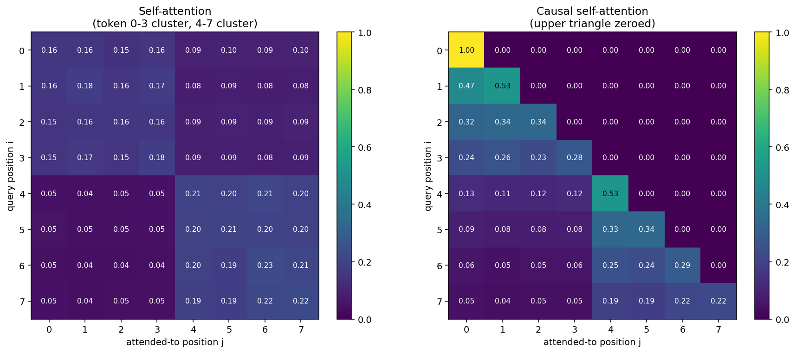
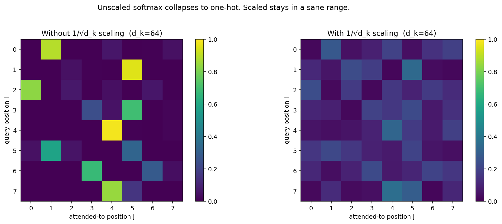
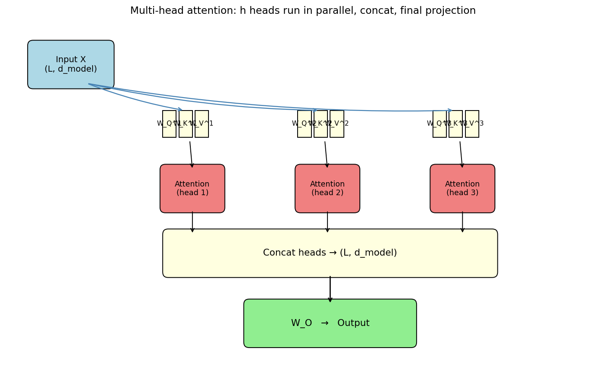
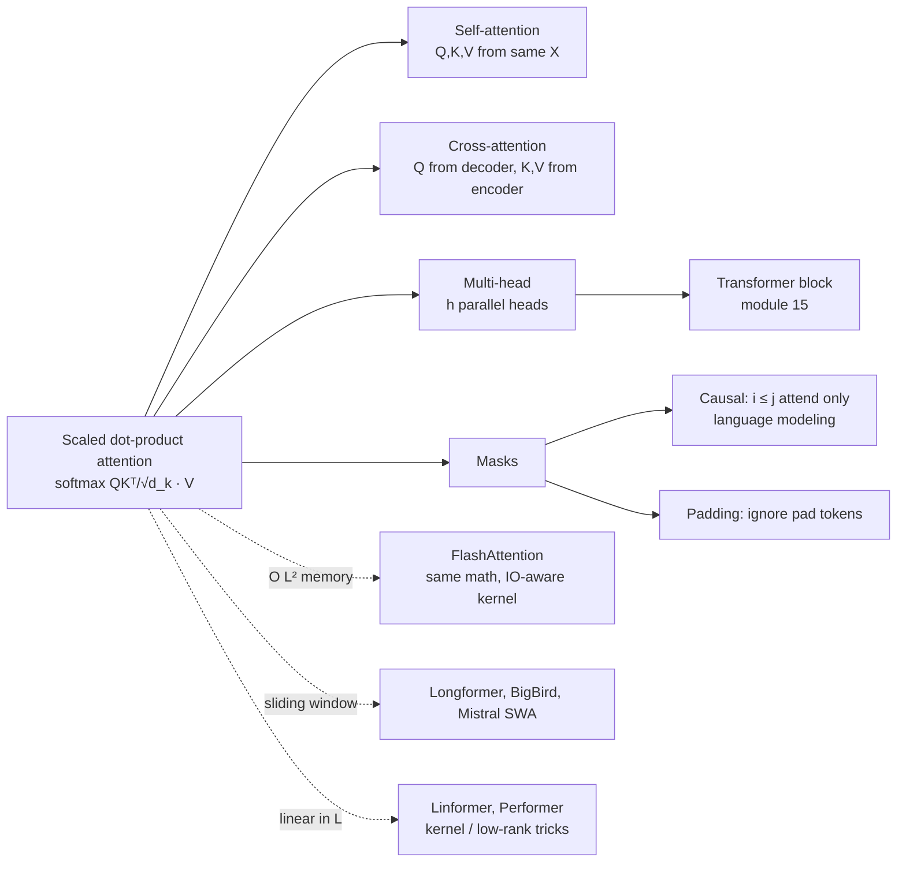

# 14 — Attention

> Goal: derive scaled dot-product attention from scratch. Each term — Q, K, V, the `√d_k` scale, the softmax — is a specific design choice that fixes a specific failure mode. Understand the choices and Transformers (module 15) become assembly.

---

## 1. Intuition

Imagine a "soft" Python dictionary. Instead of `d[key]` returning one value, you provide a query, and the dictionary returns a *weighted average of all values*, with weights equal to how similar each stored key is to your query.

That's attention. Q (query), K (keys), V (values). Output = softmax(query · keys) · values. The only design choices are how the similarity is computed and how it's normalized.

For sequence models: the query, keys, and values *all come from the input sequence itself* — that's "self-attention". Each token asks every other token "how relevant are you to me?" and mixes them in proportionally. No recurrence, no convolution. Just a giant matrix of attention weights between every pair of positions.

---

## 2. The math, derived

### 2.1 Input and projections

Let the input sequence be `X ∈ ℝ^{L × d}` (`L` tokens, each `d`-dimensional). Three learned linear projections:

```
Q = X W_Q,   K = X W_K,   V = X W_V       W_Q, W_K, W_V ∈ ℝ^{d × d_k}
```

Different projections per role: Q is "what am I looking for", K is "what do I offer", V is "what do I return when picked". Same input `X`, different views.

### 2.2 Scores

For each query token, score it against every key token via dot product:

```
S = Q Kᵀ                  ∈ ℝ^{L × L}        S[i, j] = q_i · k_j
```

`S[i, j]` is "how relevant is token `j` to token `i`".

### 2.3 Why divide by `√d_k` (the most underrated detail)

If `q_i` and `k_j` are independent zero-mean unit-variance vectors of length `d_k`, then:

```
E[ q · k ] = 0,  Var[ q · k ] = d_k
```

(`Σ over d_k terms each of variance 1`.) So the dot products have standard deviation `√d_k`. When `d_k = 64`, individual scores have std ≈ 8 — large enough that *softmax saturates*. The softmax of `[8, 0, 0]` is essentially `[1, 0, 0]` — gradient through it vanishes everywhere except one entry.

Fix: divide by `√d_k`, putting the scores back at unit variance:

```
S̃ = Q Kᵀ / √d_k
```

Softmax then operates in a sane range, gradients flow.

### 2.4 Softmax and weighted sum

```
A = softmax(S̃, axis = -1)          ∈ ℝ^{L × L}   (each row sums to 1)
Output = A V                         ∈ ℝ^{L × d_v}
```

`A[i, j]` is the attention weight token `i` places on token `j`. `Output[i] = Σ_j A[i, j] · v_j`.

Putting it all together, the **scaled dot-product attention**:

```
Attention(Q, K, V) = softmax( Q Kᵀ / √d_k ) V
```

That's the entire equation. Three matrix multiplies and a softmax. Implementable in five lines of NumPy.

### 2.5 Multi-head attention

One attention head sees the world through one set of `(W_Q, W_K, W_V)` projections. Multi-head attention runs `h` such heads in parallel with smaller per-head `d_k = d / h`, then concatenates and projects back:

```
head_i = Attention(X W_Q^i, X W_K^i, X W_V^i)
MultiHead(X) = Concat(head_1, ..., head_h) · W_O
```

Why this beats one big head: each head can specialize. Empirically, one head might track syntactic dependencies, another lexical similarity, another positional patterns. Forcing them through *one* set of projections would push the network toward a compromise.

Total compute is the same: `h` heads of dimension `d/h` is the same arithmetic as one head of dimension `d`. The win is functional, not computational.

### 2.6 Masking

Two practical needs:

- **Causal mask** (language modeling): token `i` may only attend to tokens `j ≤ i`. Implement by setting `S̃[i, j] = -∞` for `j > i` *before* softmax, which makes those entries exactly zero in `A`.
- **Padding mask**: variable-length sequences in a batch are padded; padded positions should never be attended to. Same trick: set `S̃[:, padded_positions] = -∞`.

### 2.7 Self vs cross attention

- **Self-attention**: `Q, K, V` all come from the same sequence `X`. Used in the encoder, and in the decoder for self-references.
- **Cross-attention**: `Q` from one sequence (decoder), `K, V` from another (encoder). Used to condition decoder generation on encoder output (e.g., machine translation source → target).

Same formula either way — only the inputs change.

---

## 3. Diagrams

| Script | Shows |
|---|---|
| `diagram_attention_heatmap.py` | Toy 6-token sequence, attention-weight matrix as a heatmap; the bright diagonal-ish region is "tokens attend to themselves and immediate neighbours" |
| `diagram_scale_factor.py` | Softmax distribution over scores with and without the `√d_k` scaling, for `d_k = 64`. Without scaling, softmax becomes a one-hot; gradients die |
| `diagram_multihead.py` | Schematic of multi-head attention: parallel projections, attention per head, concat, output projection |

Regenerate:
```powershell
python diagram_attention_heatmap.py
python diagram_scale_factor.py
python diagram_multihead.py
```







---

## 4. Mind-map: attention family



---

## 5. From scratch

`from_scratch.py` implements:

- `scaled_dot_product_attention(Q, K, V, mask=None)` — five lines, exactly as in the paper.
- `MultiHeadAttention` — projections, split, attention, concat, output projection.
- A verification against PyTorch's `torch.nn.functional.scaled_dot_product_attention` — the NumPy and PyTorch outputs match to within `1e-5`.

The script demonstrates:
1. Self-attention on a tiny embedded sequence; prints the attention weights.
2. Causal masking — verifies upper-triangular entries of the attention matrix are zero.
3. Verification against the PyTorch reference.

Run:
```powershell
python from_scratch.py
```

---

## 6. When to use / when it breaks

**Use when:**
- Sequence modeling (text, audio, code), any modality where positions matter and order is nontrivial.
- Long-range dependencies are important (`O(1)` path length between any two positions vs `O(L)` for RNNs).
- You have parallel compute. Attention parallelizes across positions — the killer feature over RNNs.

**Breaks when:**
- Sequence length `L` is huge. Memory and compute are `O(L²)`. Modern fixes: FlashAttention (IO-aware kernel, same math), sliding-window attention (Mistral, Longformer), linear-attention variants (Performer, Linformer). All trade off in different ways.
- Streaming inference where you can't see the future and KV-cache grows unbounded.
- Tiny data where the architectural prior of attention isn't worth the parameter count.

---

## 7. References

- Vaswani et al. — *Attention Is All You Need* (2017). Read this paper in full — it's short, well-written, and you can now follow every line.
- Bahdanau et al. — *Neural Machine Translation by Jointly Learning to Align and Translate* (2014). Attention's first appearance, in an encoder-decoder seq2seq model.
- Alammar — *The Illustrated Transformer* (blog). The clearest visual walkthrough.
- Karpathy — *Let's build GPT: from scratch, in code, spelled out* (YouTube). The best ~2 hours you can spend on this topic.
- Dao et al. — *FlashAttention* (2022). Same math, IO-aware kernel that made 8k+ context windows practical.
