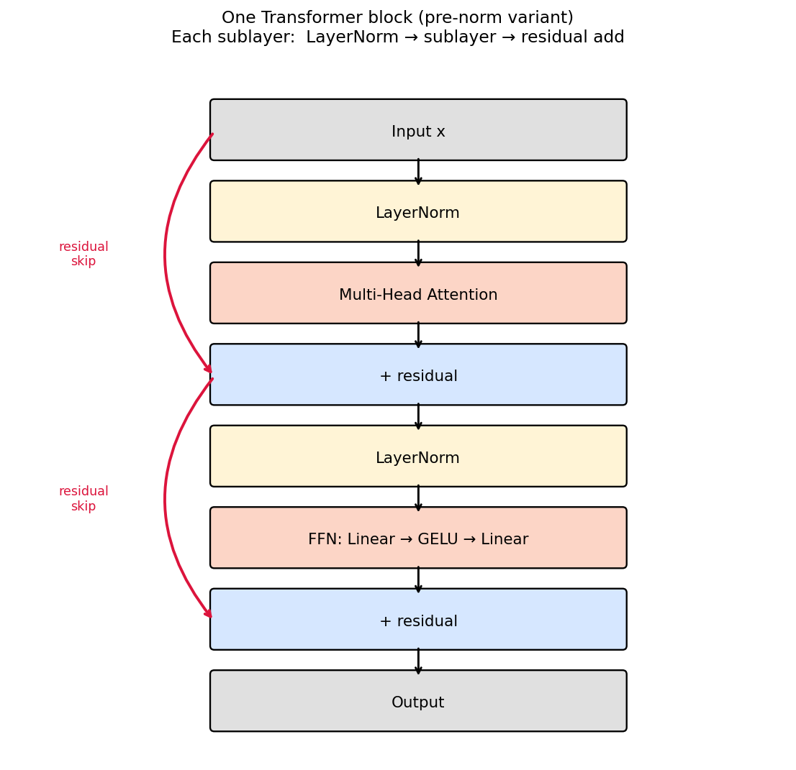
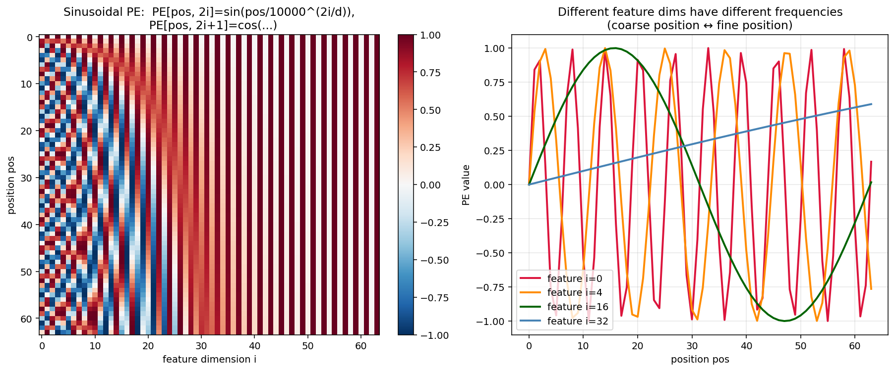
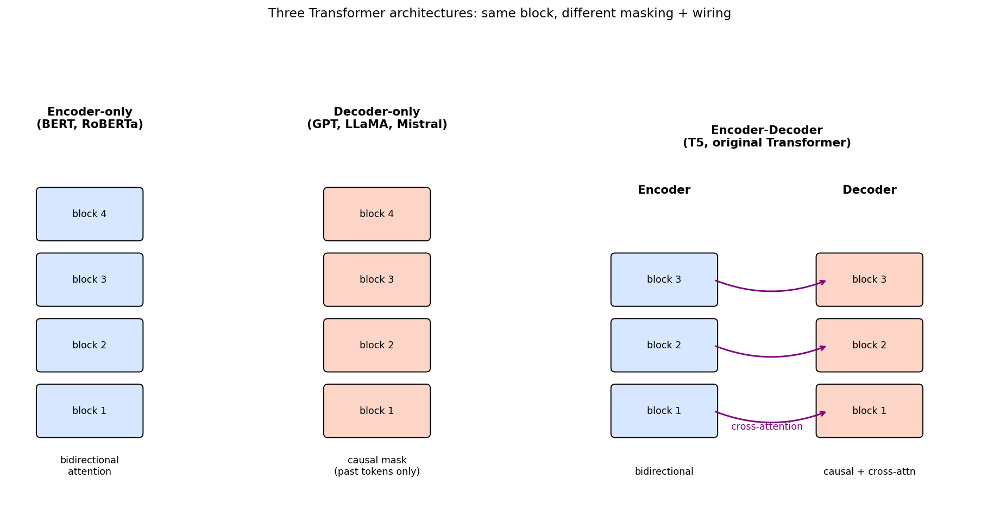
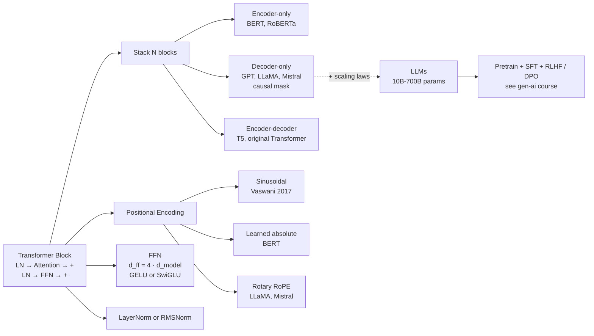

# 15 — Transformers

> Goal: assemble the Transformer block from module 14's attention + residual connections + LayerNorm + a feedforward sublayer. Understand positional encodings — how a permutation-invariant attention layer learns *order*. See how decoder-only LLMs are just this block stacked 50–100 times.

This is the final theory module. Everything before this earned its keep here.

---

## 1. Intuition

Attention (module 14) handles *what* tokens to mix and how much. It doesn't know *positions* — `[the, cat, sat]` and `[sat, cat, the]` are the same input to a pure attention layer. The Transformer adds two ingredients on top of attention:

1. **A positional encoding**, so the model can tell tokens apart by position.
2. **A feedforward (FFN) sublayer**, which gives the model per-position non-linear transformation capacity. Attention mixes; FFN computes.

Then wrap both in `LayerNorm + residual` so gradients flow, and stack the result `N` times. That's a Transformer.

---

## 2. The math

### 2.1 The Transformer block (pre-norm, modern variant)

```
x = x + MultiHeadAttention( LayerNorm(x) )
x = x + FFN( LayerNorm(x) )
```

Two sublayers, each wrapped in: `LayerNorm → sublayer → residual add`. (The original paper used "post-norm": `LayerNorm` *after* the residual. Pre-norm is now standard because it trains much more stably at depth.)

#### Residual connections (why gradient flow works at depth)

The residual `x + sublayer(x)` means the gradient at the output is at least `dL/dx_out` — it never vanishes through the sublayer multiplicatively. This is the same trick as ResNet. It's the reason you can stack 100 Transformer blocks and still train.

#### LayerNorm

```
μ = mean(x over features)
σ² = var(x over features)
x̂ = (x - μ) / √(σ² + ε)
LN(x) = γ · x̂ + β     (learnable per-feature γ, β)
```

Normalizes *per token*, across features. Batch-size-independent, unlike BatchNorm. Default in every modern Transformer.

(There's also **RMSNorm** — Zhang & Sennrich 2019 — which drops the mean-subtraction step. Used in LLaMA, Mistral. About 1% faster, roughly equivalent accuracy.)

### 2.2 The feedforward sublayer

Per-position, two linear layers with a non-linearity:

```
FFN(x) = Linear_2( GELU( Linear_1(x) ) )

Linear_1: d_model → d_ff       (typically d_ff = 4 · d_model)
Linear_2: d_ff    → d_model
```

The 4× expansion ratio is empirical; it's where most of the parameters live (`8 · d_model²` per block vs `4 · d_model²` for the attention projections). This is also where the *bulk* of the model's storage capacity lives — attention does the routing, FFN does the storage.

**GELU** (Gaussian Error Linear Unit): `x · Φ(x)` where `Φ` is the standard normal CDF. Smooth approximation of ReLU. Used in GPT, BERT, and most descendants. SwiGLU (a gated variant) is now common in LLaMA / Mistral / etc.

### 2.3 Positional encodings

Attention is permutation-invariant. The Transformer fixes this by *adding* a positional vector to each token's embedding before the first block:

```
x_in = embedding[token_id] + position_encoding[pos]
```

Three flavors you'll see:

#### Sinusoidal (Vaswani 2017)

```
PE[pos, 2i]     = sin(pos / 10000^(2i / d_model))
PE[pos, 2i + 1] = cos(pos / 10000^(2i / d_model))
```

Why this works: distinct positions get distinct vectors. *Different frequencies* per feature dimension — low-frequency dims for coarse position, high-frequency for fine position. Also, `PE[pos + k]` can be expressed as a linear function of `PE[pos]`, which (in principle) lets the model generalize to lengths it didn't see in training.

#### Learned absolute

Treat positions like vocabulary: each position 0..L_max gets a learned vector. Simple, works well within `L_max`, fails completely beyond.

#### Rotary (RoPE — Su et al. 2021)

Instead of *adding* to embeddings, *rotate* the query and key vectors by an angle proportional to position. Composes beautifully with the dot product in attention — `RoPE(q, m) · RoPE(k, n)` depends only on `m - n`. This is why RoPE-based models (LLaMA, Mistral, most modern LLMs) handle relative position naturally and extrapolate better than learned absolute encodings.

### 2.4 Three Transformer families

| Family | Used in | What it sees per token |
|---|---|---|
| **Decoder-only** (causal mask) | GPT, LLaMA, Mistral | Past tokens only. Trained on next-token prediction. The dominant LLM architecture. |
| **Encoder-only** (no mask) | BERT, RoBERTa | All tokens (bidirectional). Trained on masked-token prediction. Used for classification / embedding tasks. |
| **Encoder-decoder** | T5, original Transformer, MT models | Encoder is bidirectional; decoder is causal and cross-attends to the encoder output. Used for seq2seq tasks. |

All three use the *same block*. The only differences are masking, training objective, and how blocks are wired.

### 2.5 Scaling laws (one paragraph)

Kaplan et al. (2020) and Hoffmann et al. (Chinchilla, 2022) showed that loss is a power law in (parameters, data, compute):

```
loss(N, D, C) ≈ A · N^(-α_N) + B · D^(-α_D) + C0
```

Equivalently: doubling parameters and doubling training data reduces loss by a constant factor — predictably. **Chinchilla's correction**: the right scaling is roughly `D ≈ 20 · N` (20 tokens of training data per parameter); most pre-Chinchilla LLMs were *under*-trained for their size. Modern training recipes follow this ratio.

---

## 3. Diagrams

| Script | Shows |
|---|---|
| `diagram_block.py` | Schematic of one Transformer block with pre-norm + residual + sublayers |
| `diagram_positional.py` | Sinusoidal positional encoding visualized as a heatmap over (position, feature) |
| `diagram_architectures.py` | Encoder-only / decoder-only / encoder-decoder side by side with masking arrows |

Regenerate:
```powershell
python diagram_block.py
python diagram_positional.py
python diagram_architectures.py
```







---

## 4. Mind-map: Transformer family in 2026



---

## 5. From scratch

`from_scratch.py` implements:

- `layer_norm(x)` — pure NumPy.
- `feedforward(x, ...)` — `Linear → GELU → Linear`.
- `TransformerBlock` — pre-norm + multi-head attention + residual + FFN + residual, all in NumPy.
- `sinusoidal_position_encoding(L, d_model)`.

The script:
1. Builds a 2-block decoder-only Transformer (with causal masking) at `d_model = 32, n_heads = 4`.
2. Feeds it a tiny synthetic sequence and verifies that the output shape is what we expect.
3. Shows that the same block in eval mode produces identical outputs across multiple forward passes (no Dropout active, just sanity checks the math).

Full training is left to Lab D, where we use PyTorch on a real next-character task.

Run:
```powershell
python from_scratch.py
```

---

## 6. When to use / when it breaks

**Use when:**
- Sequence data of any kind in 2026: language, code, audio, video, biology (protein structure), tabular when you have enough data.
- Long-range dependencies matter.
- You have parallel compute (GPUs, TPUs).

**Breaks when:**
- Sequence is *huge* — `O(L²)` memory is a wall. Use FlashAttention (engineering, not math) or linear/sparse attention (math, with accuracy trade-offs).
- Streaming inference past the KV-cache budget.
- Tiny data — Transformers need a lot of training data to outperform inductive-bias-heavy alternatives (CNNs for vision, LSTMs for sequences).

In practice, in 2026, Transformers are the default for almost every sequence task. The question is rarely "should I use a Transformer" and almost always "which Transformer variant".

---

## 7. References

- Vaswani et al. — *Attention Is All You Need* (2017). You should now be able to read every line of this paper.
- Devlin et al. — *BERT* (2018).
- Radford et al. — *GPT-1 / GPT-2* (2018 / 2019).
- Raffel et al. — *T5* (2019). Encoder-decoder + unified text-to-text framing.
- Su et al. — *RoFormer* (2021). The RoPE paper.
- Kaplan et al. — *Scaling Laws for Neural Language Models* (2020).
- Hoffmann et al. — *Training Compute-Optimal Large Language Models* (Chinchilla, 2022).
- Karpathy — *Let's build GPT: from scratch, in code, spelled out* (YouTube). Do this before you graduate from the course.

---

## You finished the theory track.

After this module you've derived everything from linear regression to attention and assembled the Transformer block from its components. The natural next step is the [gen-ai](https://github.com/Lourdhu02/gen-ai) course — *building* with LLMs (RAG, agents, fine-tuning, multimodal, deployment). The math here is what makes the engineering there make sense.
