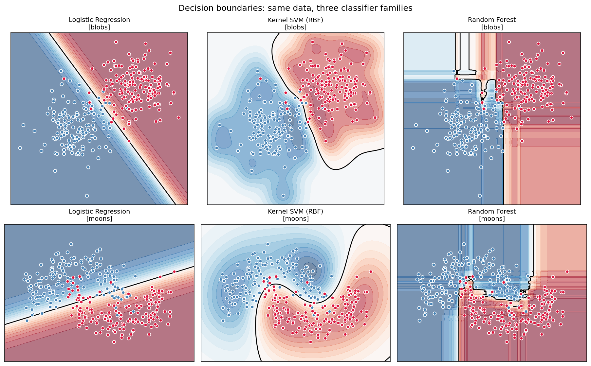

# Lab A — Classical Shootout (Logistic vs SVM vs Random Forest)

> Run after module 06. Three different families of classifier — linear, kernel, ensemble — on the *same* dataset, side by side, no scikit-learn in the core loop.

This is the "every algorithm is somebody's best algorithm" lab. When one model decisively beats the others, the data's geometry is telling you something.

---

## What this lab does

`shootout.py` imports the from-scratch implementations from modules 02, 04, and 06, trains all three on two carefully chosen datasets, and reports:

- Train and test accuracy per classifier.
- Time-to-fit (rough — wall clock).
- A 2×3 grid of decision boundaries, one row per dataset, one column per classifier.

The two datasets are designed to make different classifiers win:

| Dataset | Geometry | Predicted winner |
|---|---|---|
| Linearly separable blobs | Two Gaussian clouds | Logistic Regression (lowest variance, fastest, well-calibrated) |
| Two interleaved moons | Non-linear, curved boundary | Kernel SVM (RBF) or Random Forest |

---

## Run

```powershell
python shootout.py
```

Expected output: an accuracy table to the terminal and a `diagram_shootout.png` file.



---

## How to read the result

- **Boundary shape** is the most informative thing. Logistic draws a single line. SVM with RBF draws a curve. Random Forest draws axis-aligned blocks.
- **Boundary smoothness** is the next thing. SVM gives smooth curves (it's optimizing margin in feature space). RF gives jagged blocks (each axis-aligned cut adds a step). Logistic is the smoothest because it's just a hyperplane.
- **Accuracy gap** between models is bigger on the moons (where the true boundary is curved) than on the blobs (where any decent classifier wins).

The lesson: *the model is a hypothesis about the geometry of the boundary*. Pick wrong, no amount of hyperparameter tuning saves you. Pick right and you barely need to tune at all.

---

## Why no neural net here?

Neural nets enter in module 10. The fair comparison "linear vs kernel vs ensemble vs neural net" comes in Lab C on a larger problem (MNIST). On these tiny 2D problems an MLP would either over-fit or just rediscover one of the boundaries above.
