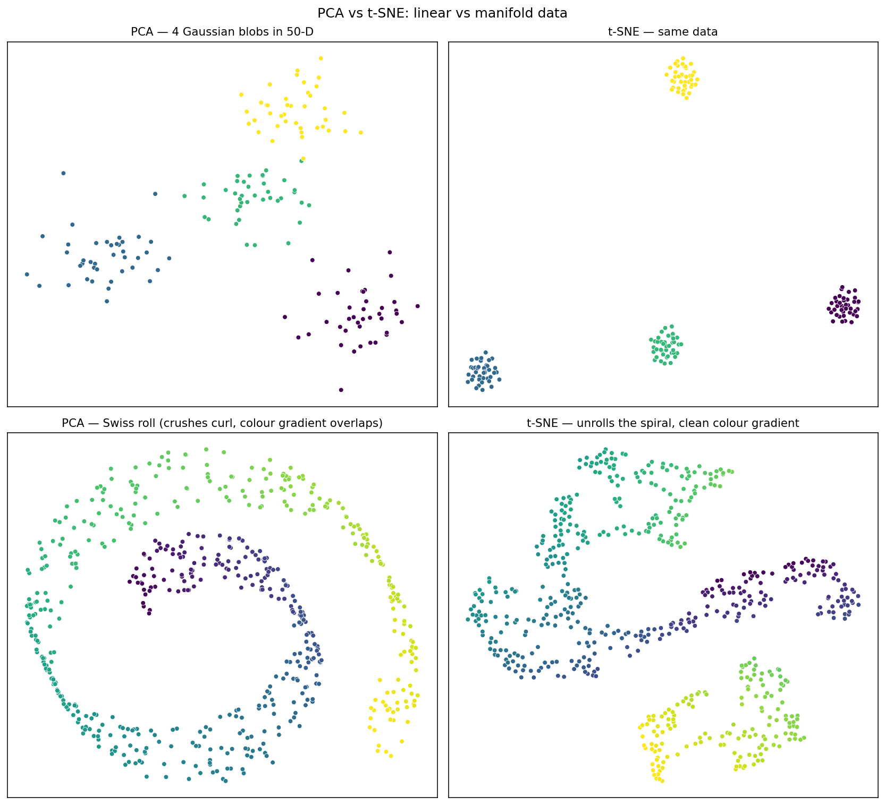

# Lab B — PCA vs t-SNE on Linear and Manifold Data

> Run after module 09. Two datasets, two algorithms, four panels: when PCA wins, when it loses spectacularly.

A note on UMAP: in practice UMAP gives results very similar to t-SNE for visualization-grade projections, with better speed and somewhat more meaningful global structure. The lab title in the course README mentions UMAP for the full comparison; to keep this lab's dependencies tight (just NumPy + matplotlib) we run only PCA and t-SNE here. If you have `umap-learn` installed, the conclusion you'd draw is the same as t-SNE on these datasets.

---

## What this lab does

`compare.py` runs both PCA and the from-scratch t-SNE (imported from module 09) on two datasets:

1. **4 Gaussian blobs in 50-D** — well-separated, *linear* structure.
2. **Swiss roll in 3-D** — a 2-D manifold curled into a 3-D spiral. Non-linear.

For each dataset it produces a side-by-side 2-D projection.

```powershell
python compare.py
```



---

## What you should see

**On the blobs (linear data):**
- Both algorithms separate the four clusters.
- PCA preserves their relative orientation. The four colours roughly stay on opposite sides of the plot, because in 50-D they really *were* on opposite sides.
- t-SNE compresses each cluster into a tight ball and scatters the balls. Their relative positions are arbitrary.

**On the Swiss roll (manifold data):**
- PCA flattens the spiral onto its highest-variance plane, which crushes the curl into a flat oval. The colour gradient (which tracks position along the roll) becomes meaningless — different colours overlap.
- t-SNE *unrolls* the spiral. The colour gradient becomes a clean rainbow band. This is what "non-linear" actually buys you.

---

## The takeaway

PCA is the right tool when the structure you care about is variance along linear directions. The moment the structure curls (text embeddings, image manifolds, anything with cyclic or nested geometry), PCA collapses it. Manifold methods like t-SNE and UMAP exist for exactly that gap.

A practical recipe that actually shows up in production:
1. **PCA first** to drop to ~50 dimensions (cheap, denoises, well-defined distances).
2. **t-SNE or UMAP second** to drop those 50 dimensions to 2 for visualization.

The two-stage pipeline is faster, less noisy, and qualitatively the same as running t-SNE on the original space.

---

## Reading the diagram critically

Three traps that beginners fall into when interpreting a t-SNE plot:

1. **Distances aren't meaningful.** Two clusters drawn far apart aren't necessarily far apart in input space.
2. **Cluster sizes aren't meaningful.** A big ball doesn't mean wide variance.
3. **Hyperparameter sensitivity.** Different perplexity values produce qualitatively different plots. Always show several.

The Distill.pub article *How to Use t-SNE Effectively* (Wattenberg et al., 2016) demonstrates these traps with interactive examples. Required reading.
