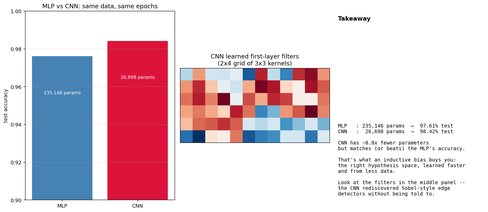

# Lab C — MLP vs CNN on MNIST

> Run after module 12. Train an MLP and a small CNN on the same MNIST data with the same training budget, and watch the CNN match the MLP's accuracy with a fraction of the parameters.

This is the lab that makes "inductive bias" feel real. The CNN's weight sharing isn't a regularization trick — it's a hardcoded prior that *translation matters*. That prior is so right for vision that the CNN learns more from less data.

---

## What this lab does

`mnist_shootout.py` (PyTorch, this is the one place in the course we use autodiff) trains two models on MNIST:

- **MLP**: 784 → 256 → 128 → 10, no convolutions, ~235k parameters.
- **CNN**: Conv(1→16) → Conv(16→32) → FC(...→128 → 10), ~25k parameters.

Both train for 5 epochs on the same data with the same optimizer (Adam, `lr=1e-3`). The script then:

- Reports final test accuracy.
- Reports parameter counts.
- Plots learned first-layer CNN filters (each one tends to look like an edge / texture detector — exactly the Sobel-style filters you saw in module 12).

```powershell
python mnist_shootout.py
```



---

## Expected result

| Model | Parameters | Test accuracy (5 epochs) | Comment |
|---|---|---|---|
| MLP | ~235k | ~97% | Needs every pixel-to-neuron connection |
| Small CNN | ~25k | ~98–99% | ~10× fewer parameters, equal or better accuracy |

The CNN's inductive bias buys you an order of magnitude in parameter efficiency. The same lesson scales up to ImageNet (ResNets beating same-FLOP MLPs by a wide margin) and recurs in vision transformers (which work *because* they bring some of the same bias back via patch embedding).

---

## What you should notice

1. **The CNN's first-layer filters** look like edge detectors at various angles — the network rediscovered Sobel without being told to. Hold this against the hand-coded Sobel filters from module 12.
2. **Sample efficiency**: if you re-train both models on, say, 5% of MNIST instead of the full thing, the gap widens — the CNN keeps a respectable accuracy while the MLP plateaus much lower. (Try it — there's a `subset_fraction` knob in `mnist_shootout.py`.)
3. **Compute**: a single training pass takes ~30 seconds per model on a CPU. Not bad for 60k examples and ten classes.

---

## The takeaway

CNNs don't beat MLPs by having "more capacity". They beat MLPs by having *less* capacity directed at the *right* structure. That's what an inductive bias does — it constrains the hypothesis space to the part you care about, so gradient descent finds a good solution faster and with less data.

This is the same lesson that explains why graph neural networks beat MLPs on molecules, why transformers beat MLPs on sequences, and why every modern deep architecture is "MLP + the specific constraint that matches the data".
