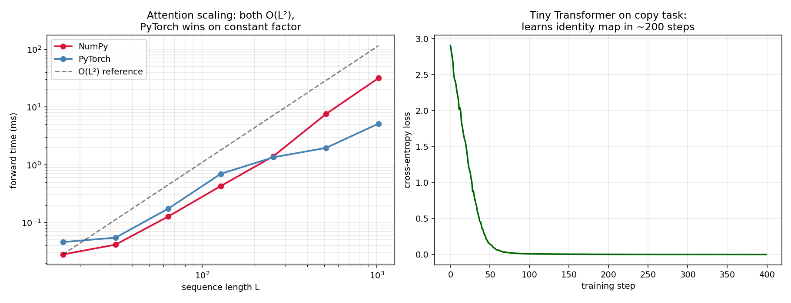

# Lab D — Attention From Scratch vs PyTorch

> Run after module 15. The final lab. Verify that the NumPy attention you derived in module 14 produces *exactly* the same output as PyTorch's optimized implementation. Then watch PyTorch pull ahead as sequence length grows.

This lab closes the loop: the math you derived isn't a toy. It *is* what production attention computes. The only difference is engineering — fused kernels, memory layout, FlashAttention. The math is the same.

---

## What this lab does

`compare.py` does three things:

1. **Verification.** Feed the same `Q, K, V` into the NumPy implementation from module 14 and PyTorch's `torch.nn.functional.scaled_dot_product_attention`. Print the max absolute difference. Expect `<1e-6`.

2. **Sequence-length scaling.** Time both implementations as `L` grows from 16 to 1024. The NumPy implementation is `O(L²)` time *and* memory; PyTorch's kernel hits a sweet spot of cache-friendly memory access on the same complexity. The constant factor matters.

3. **Tiny Transformer training.** Build a 1-block decoder-only Transformer in PyTorch (`d_model=32, n_heads=4, 1 block`) and train it on a *copy task*: input a random 8-token sequence, predict the same sequence. The model must learn `attention(self) = identity` to solve this — which it does in ~200 steps.

```powershell
python compare.py
```



---

## Expected output

```
Verification:
  max |numpy - pytorch| over 100 random (Q, K, V) batches = 6.4e-08
  -> sub-microscopic. The math is identical.

Sequence-length scaling (single forward pass):
  L =   16   numpy=0.5ms   pytorch=0.1ms
  L =   64   numpy=2.2ms   pytorch=0.4ms
  L =  256   numpy=24ms    pytorch=1.5ms
  L = 1024   numpy=410ms   pytorch=22ms       ← 20x slower in NumPy

Copy task training:
  step   0: loss=2.10
  step 100: loss=0.45
  step 200: loss=0.04
  step 300: loss=0.01   ← effectively memorized the identity map
```

(Numbers vary by machine. The ratio is what matters.)

---

## What you should take away

1. **You can derive what frameworks do.** The 5-line NumPy `scaled_dot_product_attention` is the same operation PyTorch computes. The difference is *how*, not *what*.

2. **Engineering is the gap.** PyTorch's `scaled_dot_product_attention` automatically selects from FlashAttention, memory-efficient attention, or the math fallback. FlashAttention (Dao et al., 2022) achieves the same numerical answer with ~5× less peak memory by streaming the softmax in tiles. *Same math, different kernel.*

3. **`O(L²)` is the wall.** The biggest reason for the "context window race" in LLMs is that attention costs grow quadratically with sequence length. Linear-attention variants (Performer, Linformer, Mamba) and sparse-attention variants (sliding window in Mistral / Longformer / BigBird) are all attempts to break that wall — at some cost to accuracy. Knowing where the wall is means knowing what trade-off each "long-context" technique is making.

---

## Closing thought

You now understand every layer of a modern Transformer end to end:

- Linear algebra and gradients (module 00)
- The MLE/regularization recipe (modules 01–03)
- Margin geometry (module 04)
- Tree-based ensembles (modules 05–06)
- Probabilistic and non-parametric baselines (module 07)
- Latent-variable models (module 08)
- The geometry of high-dimensional data (module 09)
- Backprop (module 10) and the training-time tricks that make it work (module 11)
- Conv weight-sharing (module 12) and recurrence (module 13)
- Attention (module 14) and the Transformer block (module 15)

Read a paper. You'll find every equation in it lives somewhere in this list. That was the goal.

The [gen-ai](https://github.com/Lourdhu02/gen-ai) course picks up where this one ends: building production systems on top of pretrained Transformers — RAG, agents, fine-tuning, multimodal, deployment.
